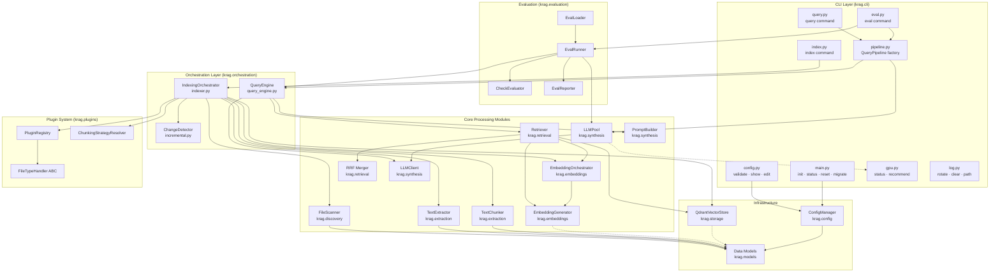
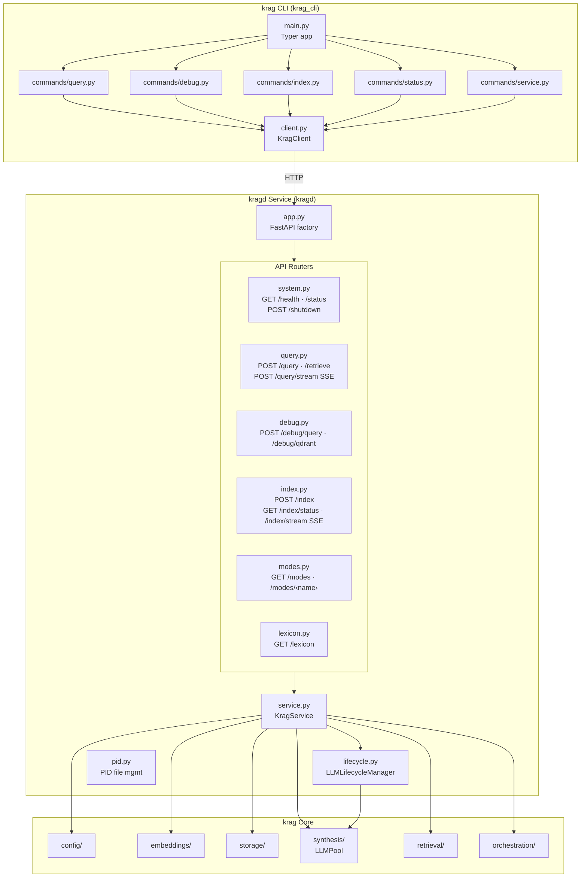
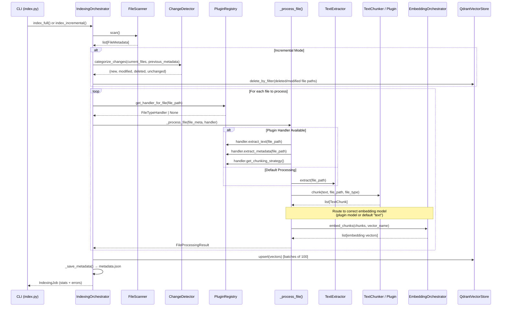
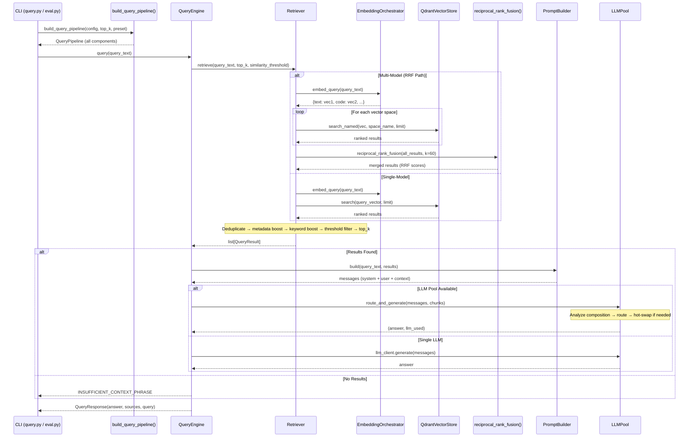
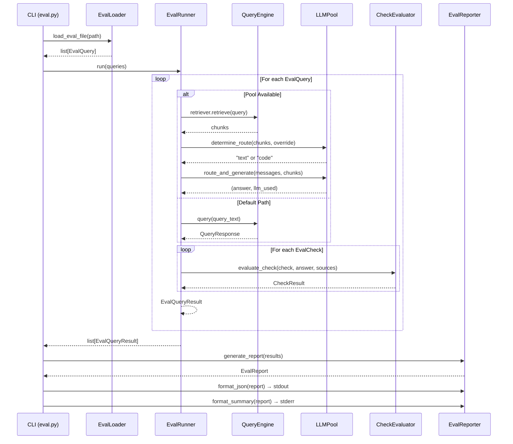
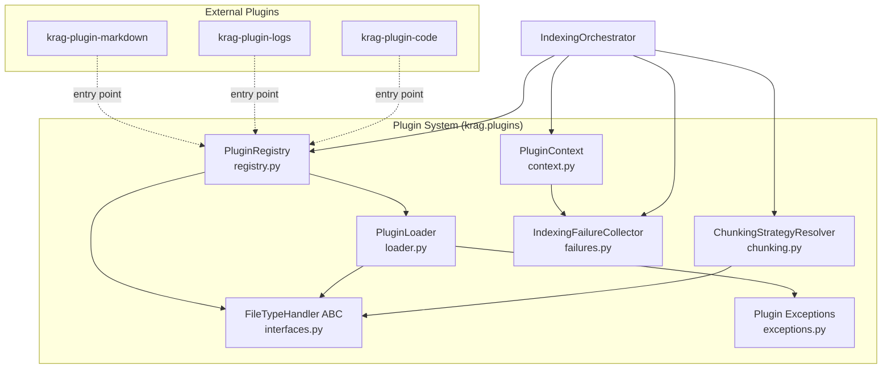
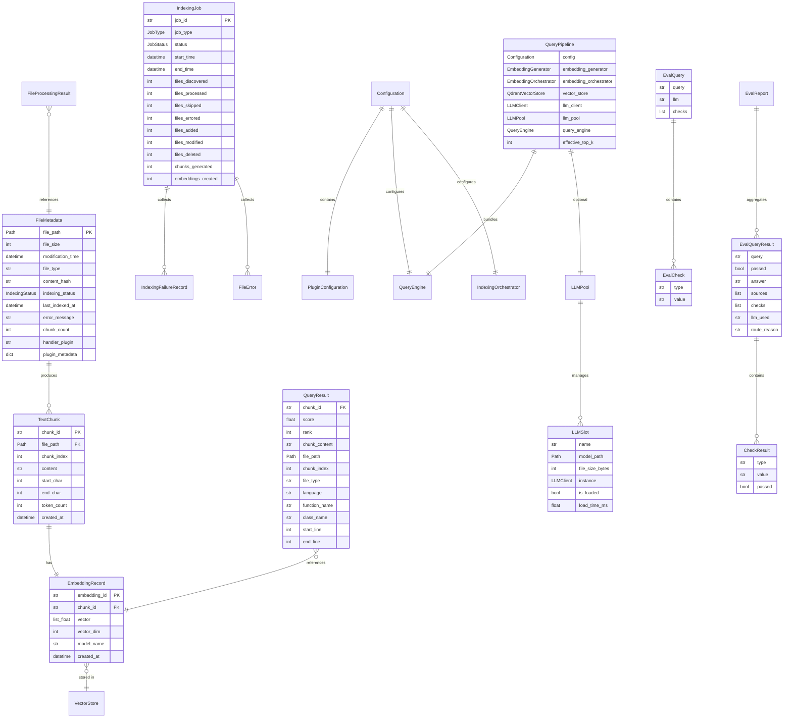
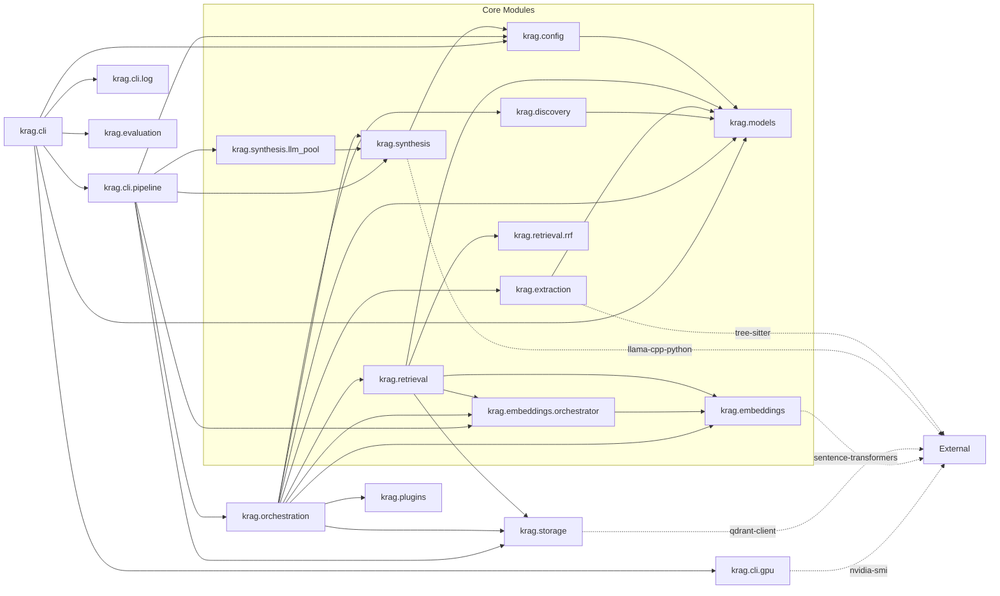

# Architecture: krag

**Version**: 0.1.0  
**Last Updated**: 2026-02-18  
**Scope**: Local-first RAG with multi-model indexing, multi-LLM routing, plugin-based file handling, and evaluation harness

---

## Overview

krag is a local-first, personal RAG (Retrieval-Augmented Generation) system. It indexes text-based and code files from local and network-attached storage, generates vector embeddings using multiple models, stores them in an embedded Qdrant database with named vector spaces, and answers natural language queries by retrieving relevant content and synthesizing answers through one or two local LLMs.

The system operates as a CLI application built with Typer and Rich. All processing runs on-device with no cloud dependencies. The architecture follows a modular pipeline design where each stage has a single responsibility, well-defined inputs and outputs, and can be tested independently.

Key capabilities added since the initial Phase 1 design:

- **Multi-model embeddings** — plugins can declare specialized embedding models (e.g., code embeddings) that run alongside the default text model
- **Named vector spaces** — Qdrant stores vectors from each model in separate spaces, merged at query time via Reciprocal Rank Fusion (RRF)
- **Multi-LLM routing** — an LLM pool manages text and code LLMs with automatic routing based on retrieved chunk composition, supporting simultaneous or hot-swap modes depending on VRAM
- **Plugin system** — file-type handler plugins provide custom text extraction, metadata enrichment, chunking strategies, and embedding model selection for specialized file types
- **Evaluation harness** — TOML-based test suites with substring/source/hallucination checks and per-query LLM routing
- **Prompt presets** — named prompt profiles (strict, balanced, verbose, code) that bundle system prompts with generation parameters
- **Shared pipeline factory** — single construction point for all query/eval infrastructure, eliminating duplication across CLI commands

---

## System Architecture

### High-Level Component Diagram



---

## Service Architecture (Sprint 007)

krag operates in two modes: **service mode** (client-server via `krag`/`kragd`) and **direct mode** (in-process via `krag-direct`).

### Three-Package Layout

| Package | Entry Point | Purpose |
|---------|-------------|---------|
| `kragd` | `kragd` | FastAPI service daemon — loads models once, serves queries |
| `krag_cli` | `krag` | Thin CLI client — sends HTTP requests to kragd |
| `krag.cli` | `krag-direct` | Original in-process CLI — no kragd needed |

### Service Architecture Diagram



### Key Design Decisions

1. **Sync route handlers** (R-02): Most endpoints use `def` (not `async def`) because LLM inference and embedding are blocking. SSE streaming endpoints (`/index/stream`, `/query/stream`) use `async def` with `EventSourceResponse` from sse-starlette.
2. **LLM Lifecycle** (R-04/R-06): `LLMLifecycleManager` wraps `LLMPool` without modifying it. Primary LLM stays loaded permanently; secondary unloads after configurable idle timeout via asyncio timer.
3. **PID file management** (R-07): Uvicorn handles SIGTERM natively; `POST /shutdown` sends SIGTERM to self; `krag stop` reads PID file.
4. **Raw Qdrant bypass** (R-09): `POST /debug/qdrant` calls `QdrantVectorStore` directly, bypassing Retriever (no dedup, boost, RRF).
5. **Direct mode preserved**: `krag-direct` entry point is unchanged — runs entirely in-process, does not import `kragd`.
6. **SSE streaming** (US5/US6): Real-time index progress and token-by-token query answers use Server-Sent Events via sse-starlette. LLM streaming holds the pool lock only during routing/swap, then releases it — the slot is marked `streaming=True` to prevent concurrent access. Thread-to-async bridging uses `asyncio.Queue` with `run_coroutine_threadsafe`.
7. **CORS** (US3): `CORSMiddleware` with configurable `allow_origins` (default `["*"]`) supports Tauri webview and browser-based clients.

---

## Directory Structure

(updated for service architecture)

```
src/krag/                    # Core RAG library (unchanged)
├── cli/                     # Direct-mode CLI (krag-direct entry point)
│   └── main.py              # Original in-process CLI
├── config/                  # Configuration management
├── embeddings/              # Embedding generation
├── models/                  # Data models (includes ServiceConfiguration)
├── orchestration/           # Indexing orchestrator
├── retrieval/               # Vector retrieval + RRF
├── storage/                 # Qdrant vector store
└── synthesis/               # LLMPool, LLMClient, PromptBuilder

src/kragd/                   # Service daemon package
├── __init__.py
├── __main__.py              # Entry point: kragd (uvicorn launcher)
├── app.py                   # FastAPI app factory with lifespan
├── lifecycle.py             # LLMLifecycleManager (idle timeout)
├── pid.py                   # PID file utilities
├── schemas.py               # Pydantic request/response models
├── service.py               # KragService (central orchestrator)
└── routers/
    ├── system.py            # /health, /status, /shutdown
    ├── query.py             # /query, /retrieve
    ├── debug.py             # /debug/query, /debug/qdrant
    └── index.py             # /index, /index/status

src/krag_cli/                # CLI client package
├── __init__.py
├── __main__.py              # Entry point: krag
├── main.py                  # Typer app with subcommands
├── client.py                # KragClient (HTTP wrapper)
├── config.py                # CLI-local config reader
├── display.py               # Rich formatting for query results
└── commands/
    ├── query.py             # krag query, krag retrieve
    ├── debug.py             # krag debug query, krag debug qdrant
    ├── index.py             # krag index, krag index-status
    ├── status.py            # krag status, krag health
    └── service.py           # krag start, krag stop
```

### Original Directory Structure

The original krag core directory structure remains unchanged:

```
src/krag/
├── __init__.py              # Package root, exports __version__
├── cli/                     # Command-line interface (Typer + Rich)
│   ├── __init__.py
│   ├── __main__.py          # Entry point for `python -m krag`
│   ├── main.py              # App definition, top-level commands
│   ├── index.py             # `krag index` command
│   ├── query.py             # `krag query` command
│   ├── eval.py              # `krag eval` command
│   ├── config.py            # `krag config` sub-commands
│   ├── gpu.py               # `krag gpu` sub-commands + VRAM utilities
│   ├── log.py               # `krag log` sub-commands (rotate/clear/path)
│   ├── pipeline.py          # Shared query pipeline factory
│   ├── plugin.py            # `krag plugin` sub-commands
│   └── utils.py             # CLI utilities (exit_with_code)
├── config/                  # Configuration management
│   ├── __init__.py
│   ├── settings.py          # ConfigManager: load, save, validate, migrate
│   ├── defaults.py          # Default constant values
│   ├── logging.py           # Logging setup (file + console handlers)
│   ├── path_reducer.py      # Path alias resolution for display
│   └── xdg.py              # XDG Base Directory helpers and migration
├── discovery/               # File system scanning
│   ├── __init__.py
│   └── scanner.py           # FileScanner: recursive file discovery
├── embeddings/              # Vector embedding generation
│   ├── __init__.py
│   ├── generator.py         # EmbeddingGenerator: sentence-transformers wrapper
│   └── orchestrator.py      # EmbeddingOrchestrator: multi-model routing
├── evaluation/              # Evaluation harness
│   ├── __init__.py
│   ├── checks.py            # Check evaluators (substring, source, hallucination)
│   ├── loader.py            # TOML eval file parser
│   ├── reporter.py          # JSON + human-readable report generation
│   └── runner.py            # EvalRunner: orchestrates eval queries
├── extraction/              # Text extraction and chunking
│   ├── __init__.py
│   ├── text_extractor.py    # TextExtractor: file reading + encoding
│   └── chunker.py           # TextChunker: text splitting with overlap
├── models/                  # Pydantic data models and exceptions
│   ├── __init__.py
│   ├── configuration.py     # Configuration (BaseSettings)
│   ├── file_metadata.py     # FileMetadata, IndexingStatus
│   ├── text_chunk.py        # TextChunk
│   ├── embedding.py         # EmbeddingRecord
│   ├── query_result.py      # QueryResult (with enriched code metadata)
│   ├── indexing_job.py      # IndexingJob, JobType, JobStatus, FileError
│   └── exceptions.py        # KragError hierarchy
├── orchestration/           # Pipeline coordination
│   ├── __init__.py
│   ├── indexer.py           # IndexingOrchestrator: full + incremental + _process_file
│   ├── query_engine.py      # QueryEngine: retrieval + synthesis
│   └── incremental.py       # ChangeDetector: file change categorization
├── plugins/                 # Plugin system for file type extensions
│   ├── __init__.py
│   ├── registry.py          # PluginRegistry: discovery, lifecycle, extension map
│   ├── interfaces.py        # FileTypeHandler ABC, ChunkingStrategy enum
│   ├── loader.py            # Plugin import and version checking
│   ├── chunking.py          # ChunkingStrategyResolver, CustomChunkerAdapter
│   ├── context.py           # PluginContext: service access for plugins
│   ├── failures.py          # IndexingFailureCollector
│   └── exceptions.py        # Plugin exception hierarchy
├── retrieval/               # Similarity search and ranking
│   ├── __init__.py
│   ├── retriever.py         # Retriever: query → dedup → boost → rank
│   └── rrf.py               # Reciprocal Rank Fusion for multi-model merge
├── storage/                 # Vector database abstraction
│   ├── __init__.py
│   ├── vector_store.py      # VectorStore ABC
│   └── qdrant_impl.py       # QdrantVectorStore (named vectors, delete_by_filter)
└── synthesis/               # LLM answer generation
    ├── __init__.py
    ├── llm_client.py         # LLMClient: local LLM inference via llama-cpp-python
    ├── llm_pool.py           # LLMPool: multi-LLM lifecycle, routing, hot-swap
    └── prompt_builder.py     # PromptBuilder: presets + context formatting
```

Each top-level package under `src/krag/` represents a distinct module boundary. Modules communicate through the data models defined in `krag.models` and follow a strict dependency direction: CLI → Orchestration → Core Modules → Infrastructure.

---

## Pipelines

### Indexing Pipeline

The indexing pipeline transforms files on disk into searchable vector embeddings. It is coordinated by `IndexingOrchestrator` in `krag.orchestration.indexer`. Plugin-provided file handlers can override any stage of per-file processing.



**Stages in detail:**

1. **Discovery** — `FileScanner.scan()` walks configured directories using `Path.rglob("*")`. Applies exclusion patterns (glob matching against path components and parent directories), filters by supported file extensions, skips hidden files (dot-prefix). Follows symlinks with cycle detection when configured. Produces `FileMetadata` records with SHA-256 content hashes.

2. **Change Detection** (incremental only) — `ChangeDetector.categorize_changes()` compares the current file set against previously indexed metadata loaded from `metadata.json`. Classification logic: file absent → `DELETED`; no prior record → `NEW`; modification time matches within 1ms → `UNCHANGED`; content hash matches despite mtime difference → `UNCHANGED`; hash differs → `MODIFIED`. For modified/deleted files, existing vectors are deleted via `delete_by_filter` before re-indexing.

3. **Per-File Processing** (`_process_file`) — Shared method used by both `index_full()` and `index_incremental()`, eliminating code duplication. Returns a `FileProcessingResult` dataclass. The method:
   - Resets chunker state at the start of each file (prevents leakage across files)
   - Attempts plugin extraction first; on plugin failure, records the error, disables the plugin, and falls through to default extraction
   - Resolves chunking strategy from plugins (DEFAULT, CUSTOM, or fallback)
   - Routes embeddings to the correct model via `EmbeddingOrchestrator` (plugin-declared or default "text" space)
   - Builds payloads with enriched metadata from plugins (language, function_name, class_name, start_line, end_line)

4. **Text Extraction** — `TextExtractor.extract()` reads file content with automatic encoding detection (tries UTF-8, falls back to Latin-1). Normalizes whitespace for non-code files. Enforces a configurable maximum file size limit; files exceeding it are skipped.

5. **Chunking** — `TextChunker.chunk()` splits extracted text into overlapping segments. Uses file-type-aware separator hierarchies:
   - **Code**: `\n\n` → `\n` → ` `
   - **Markdown**: `\n## ` → `\n# ` → `\n\n` → `\n` → ` `
   - **Text**: `\n\n` → `. ` → `! ` → `? ` → `\n` → ` `

   Splitting is recursive: if a chunk exceeds `chunk_size`, it is re-split using the next separator in the hierarchy. Overlap of `chunk_overlap` characters is prepended from the previous chunk's tail. Plugins can provide custom chunkers (e.g., AST-aware code chunking) via `ChunkingStrategy.CUSTOM`.

6. **Embedding Generation** — `EmbeddingOrchestrator` manages multiple `EmbeddingGenerator` instances. Each generator wraps `sentence-transformers` and encodes chunk text into dense vectors. Default model: `BAAI/bge-base-en-v1.5` (768 dimensions). Plugins can declare a specialized model (e.g., `jinaai/jina-embeddings-v2-base-code` for code files) that is loaded on-demand with VRAM budget checking. Embeddings are L2-normalized. Empty text produces a zero vector.

7. **Vector Storage** — `QdrantVectorStore.upsert()` persists embedding vectors with metadata payloads. When multi-model embeddings are active, vectors are stored in named vector spaces (e.g., `"text"`, `"code"`). String UUIDs are converted to integer IDs via SHA-256 hashing for Qdrant compatibility. Upserts are batched in groups of 100.

8. **Metadata Persistence** — After indexing completes, `IndexingOrchestrator._save_metadata()` serializes the `indexed_files` dictionary to `metadata.json` alongside the vector store. This enables incremental indexing across separate CLI invocations.

### Query Pipeline

The query pipeline retrieves relevant content and synthesizes answers. It is coordinated by `QueryEngine` in `krag.orchestration.query_engine`, with infrastructure assembled by `build_query_pipeline()` in `krag.cli.pipeline`.



**Stages in detail:**

1. **Pipeline Assembly** — `build_query_pipeline()` in `krag.cli.pipeline` is the single construction point for all query infrastructure, used by both `query` and `eval` commands. It handles: XDG-aware config resolution, vector-store pre-check with user-friendly errors, EmbeddingGenerator + EmbeddingOrchestrator setup (including plugin model registration), QdrantVectorStore (with named vectors when multi-model), LLMClient + LLMPool construction (reusing the pool's text LLM to avoid double-loading), and QueryEngine assembly. Returns a frozen `QueryPipeline` dataclass.

2. **Query Embedding** — `EmbeddingOrchestrator.embed_query()` embeds the query text with **all** active models simultaneously, returning a dict of `{vector_name: embedding}`. For single-model setups, only the default "text" embedding is produced.

3. **Similarity Search** — When multiple models are active, `Retriever` performs separate searches per named vector space via `QdrantVectorStore.search_named()`, then merges results using Reciprocal Rank Fusion (k=60). RRF uses rank positions rather than raw scores, making it robust to different score distributions across models. For single-model setups, a standard cosine similarity search is performed.

4. **Result Post-Processing** — After initial retrieval, results go through a multi-stage refinement:
   - **Deduplication**: Content-hash-based dedup (MD5 of normalized whitespace), keeping highest-scoring copy
   - **Metadata boost**: Queries matching `function_name`/`class_name` metadata get a score bump (0.08 normal, 0.003 RRF)
   - **Keyword boost**: Queries with substring matches in chunk content get a score bump (0.05 normal, 0.002 RRF)
   - **Similarity threshold**: Chunks below `similarity_threshold` (default 0.2) are filtered out (skipped for RRF results since RRF scores are not comparable to cosine similarity)
   - **Top-k trim**: Final results trimmed to requested `top_k`

5. **Prompt Construction** — `PromptBuilder.build()` assembles chat-style messages using the active preset. The preset determines the system prompt and generation parameters. Context chunks are labeled with source paths (shortened via `PathReducer`) and truncated to `max_context_length` characters. When no results are retrieved, an insufficient-context short-circuit returns a standard phrase without LLM invocation.

6. **LLM Routing and Generation** — When an `LLMPool` is available (code model configured):
   - `_analyze_chunk_composition()` examines retrieved chunks: if >40% are code files (by `file_type` or extension), routes to code LLM. Markdown files mixed with code files are counted as code-aligned to prevent documentation from diluting the code signal.
   - The pool automatically couples the `"code"` prompt preset when routing to the code LLM.
   - In **simultaneous mode** (both models in VRAM), routing is instant.
   - In **hot-swap mode** (one model at a time), the pool unloads the current model and loads the target before generating.
   - Per-query or global `--llm` overrides bypass automatic routing.

### Evaluation Pipeline

The evaluation pipeline runs automated test suites against the RAG system. Queries, expected checks, and per-query LLM overrides are defined in TOML files.



**Check types:**

| Check Type | Behavior |
|------------|----------|
| `substring` | Case-insensitive substring match in the answer text |
| `source_cited` | Verifies a specific file path appears in retrieved sources |
| `no_hallucination` | Verifies the answer contains the insufficient-context phrase (for off-topic queries) |

**TOML format:**

```toml
[[queries]]
query = "What is the default chunk size?"
llm = "text"  # optional per-query LLM override

[[queries.checks]]
type = "substring"
value = "384"
```

---

## Module Responsibilities

### `krag.cli` — Command-Line Interface

The CLI is implemented with Typer and Rich. It is a thin presentation layer: it parses arguments, instantiates orchestrators, invokes operations, and formats output. No business logic resides in the CLI. The `pipeline.py` module provides a shared pipeline factory used by `query` and `eval` commands.

| Command | Purpose |
|---------|---------|
| `krag init` | Create default configuration file (TOML or YAML) |
| `krag index` | Run full or incremental indexing |
| `krag query` | Query the knowledge base with optional synthesis |
| `krag eval` | Run evaluation queries from TOML file (JSON → stdout, summary → stderr) |
| `krag status` | Display system status and index statistics |
| `krag config validate` | Validate configuration file |
| `krag config show` | Display current configuration |
| `krag config edit` | Open configuration in system editor |
| `krag migrate` | Convert YAML config to TOML format |
| `krag reset` | Remove configuration, data, and/or logs |
| `krag plugin list` | List installed plugins with status |
| `krag plugin info <name>` | Show detailed plugin information |
| `krag plugin enable <name>` | Enable a disabled plugin |
| `krag plugin disable <name>` | Disable an enabled plugin |
| `krag plugin validate` | Check plugin compatibility |
| `krag plugin install` | Install a plugin package |
| `krag gpu status` | Show GPU/CUDA availability and VRAM |
| `krag gpu recommend` | Recommend `n_gpu_layers` setting for current hardware |
| `krag log rotate` | Archive current log file (max 5 backups) |
| `krag log clear` | Truncate log file to zero bytes |
| `krag log path` | Print log file location |

Global options (`--verbose`, `--version`) are handled by a Typer callback on the main app. Automatic migration from legacy `~/.krag` paths to XDG locations runs on first invocation when legacy data is detected.

#### `pipeline.py` — Shared Pipeline Factory

`build_query_pipeline()` is the single construction point for all query/eval infrastructure. It:

1. Resolves config path (XDG-aware discovery with TOML/YAML fallback)
2. Loads and validates configuration
3. Checks vector store existence (user-friendly error if not initialized)
4. Creates `EmbeddingGenerator` and `EmbeddingOrchestrator` (with plugin model registration)
5. Creates `QdrantVectorStore` (named vectors when multi-model)
6. Creates LLM infrastructure: `LLMPool` when code model is configured (reusing the pool's text LLM as the standalone client to avoid double-loading), or standalone `LLMClient` otherwise
7. Creates `QueryEngine` with all parameters (presets, thresholds, orchestrator, aliases)

Returns a frozen `QueryPipeline` dataclass bundling all components.

### `krag.config` — Configuration Management

`ConfigManager` provides static methods for the configuration lifecycle:

- **`load(path)`** — Auto-detects file format from extension (`.toml` or `.yaml`/`.yml`). TOML files use a section-based layout (`[directories]`, `[embedding]`, `[embedding_code]`, `[chunking]`, `[llm]`, `[plugins]`, etc.) that is flattened into `Configuration` model fields.
- **`find_and_load()`** — Discovers the config file via XDG search order and loads it in one call. Checks `./krag.toml`, then `XDG_CONFIG_HOME/krag/config.toml`, then `config.yaml`.
- **`create_default(path, format)`** — Generates a default configuration file.
- **`validate(config)`** — Checks directory existence, storage path writability, valid distance metric, valid embedding device.
- **`migrate_yaml_to_toml(yaml_path, toml_path)`** — Converts legacy YAML configuration to the section-based TOML format.

`PathReducer` maps absolute paths to shorter display strings using configured aliases (e.g., `/home/ken` → `~`). Aliases are sorted longest-match-first.

XDG Base Directory compliance is handled by `krag.config.xdg`:

| XDG Location | Default Path | Contents |
|---|---|---|
| `XDG_CONFIG_HOME/krag/` | `~/.config/krag/` | `config.toml` |
| `XDG_CACHE_HOME/krag/` | `~/.cache/krag/` | Vector store, embedding models |
| `XDG_STATE_HOME/krag/` | `~/.local/state/krag/` | Log files, `metadata.json` |

A migration utility moves data from the legacy `~/.krag/` layout to XDG-compliant paths using `shutil.move`.

Logging (`krag.config.logging`) configures a `RotatingFileHandler` (10 MB, 5 backups) and an optional console handler. A `get_log_file_path()` helper returns the log path for CLI commands. Over ten third-party loggers (`httpx`, `transformers`, `sentence_transformers`, `qdrant_client`, etc.) are suppressed to WARNING level or above unless verbose mode is active.

### `krag.discovery` — File Scanning

`FileScanner` performs recursive directory walking across configured paths. It:

- Iterates with `Path.rglob("*")`
- Excludes hidden files (dot-prefix names)
- Matches exclusion patterns against path components and parent directory names
- Filters by supported file extension set
- Follows symlinks with cycle detection (configurable)
- Computes SHA-256 content hashes for change detection
- Classifies files as `"code"`, `"markdown"`, or `"text"` based on extension

Output: a list of `FileMetadata` records.

### `krag.extraction` — Text Extraction and Chunking

**`TextExtractor`** reads file content with encoding detection (UTF-8 → Latin-1 fallback). For non-code files, it normalizes whitespace by stripping trailing spaces and collapsing consecutive blank lines. Files exceeding `max_file_size_mb` are rejected.

**`TextChunker`** splits text into overlapping segments using recursive separator-based splitting. The separator hierarchy is chosen by file type. If no separator can split a chunk below `chunk_size`, a hard split at fixed intervals is applied. Overlap is added by prepending the tail of the previous chunk.

Output: a list of `TextChunk` records with UUIDs, character offsets, and token counts.

### `krag.embeddings` — Embedding Generation

**`EmbeddingGenerator`** wraps `sentence-transformers` (`SentenceTransformer`). It loads the configured model at construction time, suppressing verbose output from the underlying library. Provides:

- `generate_single(text)` — Single text embedding (used for queries via orchestrator)
- `generate_batch(texts, batch_size)` — Batch encoding with optional progress bar (used for indexing)
- `get_dimension()` — Returns model output dimensionality
- `get_model_info()` — Returns model metadata including max sequence length

All embeddings are L2-normalized (`normalize_embeddings=True`).

**`EmbeddingOrchestrator`** manages multiple `EmbeddingGenerator` instances mapped to named vector spaces. It:

- Maintains a default "text" model and optional additional models (e.g., "code")
- `register_model(vector_name, model_name)` — Load and register a new embedding model with VRAM budget checking (1.2 GB per model, 80% safety margin on available VRAM)
- `embed_chunks(chunks, vector_name)` — Embed text using the specified model
- `embed_query(query)` — Embed query with **all** active models simultaneously, returning `{vector_name: embedding}` dict
- `get_vector_config()` — Return Qdrant-compatible `VectorParams` for each named vector space
- `is_multi_model` property — True when more than one model is loaded

### `krag.storage` — Vector Database

`VectorStore` is an abstract base class (`ABC`) defining the storage contract:

| Method | Signature | Purpose |
|--------|-----------|---------|
| `upsert` | `(vectors: list[dict])` | Insert or update embedding records |
| `search` | `(query_vector, limit) → list[dict]` | Approximate nearest neighbor search |
| `delete` | `(ids: list[str])` | Remove records by ID |
| `get_stats` | `() → dict` | Collection statistics |

`QdrantVectorStore` implements this contract using `qdrant-client`. It supports both in-memory (`:memory:`) and disk-based storage modes. Key implementation details:

- **Named vector spaces**: Constructor accepts `vectors_config: dict[str, VectorParams]` for multi-model setups. Collections are created with separate vector spaces for each model. `is_named_vectors` property reflects the active mode.
- **ID mapping**: String UUIDs are converted to 64-bit integers via SHA-256 hashing (`_id_to_int`). The original string ID is preserved in the payload as `_original_id`.
- **Named search**: `search_named(query_vector, vector_name, limit)` searches a specific vector space, returning `_NamedSearchResult` objects compatible with the `ScoredPointLike` protocol for RRF.
- **Default search fallback**: When collection uses named vectors, `search()` automatically falls back to the `"text"` vector space.
- **Filtered deletion**: `delete_by_filter(filter_dict)` uses Qdrant's `FieldCondition`/`Filter` API to delete all vectors matching a given file path, used during incremental re-indexing.
- **Collection migration**: `_ensure_collection()` handles transitions between single-vector and named-vector schemas, with optional recreation.

### `krag.retrieval` — Similarity Search and Ranking

**`Retriever`** bridges the embedding generator/orchestrator and vector store for query-time retrieval. Constructor:

```python
Retriever(
    vector_store: VectorStore,
    embedding_generator: EmbeddingGenerator,
    embedding_orchestrator: EmbeddingOrchestrator | None = None,
)
```

When `embedding_orchestrator` is present and `is_multi_model`, the retriever uses the **RRF path**: queries each named vector space separately, then merges via Reciprocal Rank Fusion. Otherwise, it uses standard cosine similarity search.

Post-retrieval pipeline:
1. **Over-fetch**: Retrieve 3× `top_k` to compensate for dedup/filtering losses
2. **Deduplication**: Content-hash-based (MD5 of whitespace-normalized text), keeping highest-scoring copy
3. **Metadata boost**: Score bump for chunks whose `function_name`/`class_name` match query keywords (0.08 normal, 0.003 RRF). Snake_case and camelCase identifiers are split into sub-tokens.
4. **Keyword boost**: Score bump for case-insensitive substring matches in chunk content (0.05 normal, 0.002 RRF)
5. **Similarity threshold**: Filter out low-scoring chunks (skipped for RRF results since RRF scores are not comparable to cosine similarity)
6. **Top-k trim**: Final re-ranking and trim to requested count

**`reciprocal_rank_fusion()`** in `rrf.py` implements the Cormack et al. (2009) algorithm:

```python
reciprocal_rank_fusion(
    result_lists: list[list[ScoredPointLike]],
    k: int = 60,
    limit: int = 10,
) -> list[RRFScoredPoint]
```

RRF score for a document `d`: $\sum_r \frac{1}{k + rank_r(d)}$ where $r$ ranges over all result lists containing $d$ and $k$ is a smoothing constant.

### `krag.synthesis` — LLM Answer Generation

**`PromptBuilder`** assembles structured chat-style messages from query text and retrieved results using named presets:

| Preset | Temperature | top_p | repeat_penalty | max_tokens | Purpose |
|--------|-------------|-------|----------------|------------|---------|
| `strict` | 0.1 | 0.9 | 1.1 | 256 | Concise, source-grounded answers |
| `balanced` | 0.2 | 0.9 | 1.1 | 512 | Detailed answers with citations (default) |
| `verbose` | 0.3 | 0.95 | 1.05 | 1024 | Exploratory answers with full context |
| `code` | 0.1 | 0.9 | 1.1 | 768 | Code-focused with snippets and examples |

Each preset bundles a system prompt with generation parameters. `system_prompt_override` replaces a preset's prompt while keeping its generation parameters. Context chunks are labeled with source paths (shortened via `PathReducer`) and truncated to `max_context_length` characters.

When no results are retrieved, the builder returns an `INSUFFICIENT_CONTEXT_PHRASE` message without invoking the LLM.

**`LLMClient`** manages local LLM inference via `llama-cpp-python`. Model resolution supports:

- **Local GGUF files**: Loaded directly from an absolute path
- **HuggingFace downloads**: Models specified as `org/repo` are downloaded from HuggingFace Hub, with automatic quantization selection (tries `Q2_K` through `Q5_K`, smallest first). Downloaded models are cached in the XDG cache directory.
- **GPU offload**: `n_gpu_layers` controls layer offloading (0=CPU, -1=full GPU, 1-N=hybrid)
- **Test mode**: If `model=None`, the client operates without loading a model and produces fallback placeholder responses.

**`LLMPool`** manages one or two LLMs with routing and hot-swap:

```python
LLMPool(
    text_model_path: Path,
    code_model_path: Path | None = None,
    load_multi_llm: bool = False,
    n_ctx: int = 8192,
    n_gpu_layers: int = -1,
    **llm_kwargs,
)
```

Three operational modes:
- **Single**: No code model configured; all queries use text LLM
- **Hot-swap**: Code model configured but `load_multi_llm=False` or insufficient VRAM; models swap in/out as needed (unload → GC → load)
- **Simultaneous**: Both models fit in VRAM; instant routing with no swap latency

VRAM fitness check: `free_vram × 0.80 ≥ text_size + code_size + 2 × kv_cache` where `kv_cache = n_ctx × 2 KB`.

Routing logic (`_analyze_chunk_composition`):
- Each retrieved chunk is classified as "code" (by `file_type == "code"` or extension in `CODE_EXTENSIONS`) or "text"
- Markdown files (`.md`, `.mdx`, `.markdown`, `.rst`) are counted as code-aligned when at least one actual code file is present in the results
- If >40% of chunks are code-aligned, routes to code LLM
- Per-query or global `--llm` overrides bypass automatic routing

The pool exposes `text_llm_client` property so the pipeline factory can reuse the text slot's `LLMClient` instance rather than loading the model twice.

### `krag.evaluation` — Evaluation Harness

The evaluation package provides automated testing of RAG answer quality:

- **`loader.py`** — Parses `[[queries]]` from TOML files into `EvalQuery` dataclasses, each with a list of `EvalCheck` and optional `llm` field for per-query LLM routing
- **`checks.py`** — Implements `evaluate_check()` with three check types: `substring` (case-insensitive), `source_cited` (file path in sources), `no_hallucination` (insufficient context phrase present)
- **`runner.py`** — `EvalRunner` processes queries through `QueryEngine` or `LLMPool`, producing `EvalQueryResult` with `llm_used` and `route_reason` fields
- **`reporter.py`** — `EvalReport` aggregation with `format_json()` (stdout) and `format_summary()` (stderr) output

### `krag.orchestration` — Pipeline Coordination

This layer wires together the core processing modules into complete workflows.

**`IndexingOrchestrator`** is the central coordinator for both full and incremental indexing. It:

- Accepts either a `Configuration` object or individual parameters at construction
- Creates and owns instances of `TextExtractor`, `TextChunker`, `EmbeddingOrchestrator`, `QdrantVectorStore`, `ChangeDetector`, `PluginRegistry`, `PluginContext`, `ChunkingStrategyResolver`, and `IndexingFailureCollector`
- Manages `metadata.json` persistence (load on init, save after indexing)
- Filters loaded metadata to only include files within configured directories (workspace isolation)
- Supports context manager protocol (`with` statement) for resource cleanup
- Reports progress via an optional callback function
- Provides a shared `_process_file()` method used by both `index_full()` and `index_incremental()`, returning a `FileProcessingResult` dataclass

**`QueryEngine`** coordinates the query pipeline. Constructor:

```python
QueryEngine(
    vector_store: VectorStore,
    embedding_generator: EmbeddingGenerator,
    llm_client: LLMClient,
    top_k: int = 5,
    max_context_length: int = 4000,
    path_aliases: list[str] | None = None,
    preset_name: str = "balanced",
    system_prompt_override: str | None = None,
    similarity_threshold: float | None = None,
    embedding_orchestrator: EmbeddingOrchestrator | None = None,
)
```

It owns a `Retriever`, `PromptBuilder`, and reference to an `LLMClient`. It validates input (empty query detection), retrieves results, builds prompts, generates answers, and returns a `QueryResponse` dataclass. When no results pass the similarity threshold, it short-circuits with the insufficient-context phrase.

**`ChangeDetector`** implements incremental indexing logic. It categorizes files into four groups (new, modified, deleted, unchanged) by comparing filesystem state against persisted metadata. Change detection uses a two-tier strategy: modification time comparison first (fast), then content hash comparison (accurate) when mtimes differ.

### `krag.plugins` — Plugin System

The plugin system enables file type handler extensions without modifying core code. Plugins are separate Python packages discovered via entry points and loaded lazily.

**Architecture Overview:**



**Key Components:**

| Component | File | Role |
|-----------|------|------|
| `PluginRegistry` | `registry.py` | Central registry: discovery, loading, lifecycle, extension mapping |
| `PluginLoader` | `loader.py` | Plugin import, instantiation, API version checking |
| `FileTypeHandler` | `interfaces.py` | ABC all plugins must implement |
| `ChunkingStrategy` | `interfaces.py` | Enum: `DEFAULT`, `SEMANTIC`, `CODE_AWARE`, `CUSTOM` |
| `PluginContext` | `context.py` | Service access object passed to plugins during initialization |
| `ChunkingStrategyResolver` | `chunking.py` | Maps plugin chunking preferences to TextChunker instances |
| `IndexingFailureCollector` | `failures.py` | Aggregates indexing failure records from plugins and core |
| `CustomChunkerAdapter` | `chunking.py` | Wraps `chunk_text()` chunkers to full `TextChunker` interface |

**`FileTypeHandler` ABC — Full Method Surface:**

Abstract (required):
- `name: str` (property) — Plugin identifier
- `version: str` (property) — Semver version string
- `required_api_version: str` (property) — Minimum compatible API version
- `supported_extensions() → list[str]` — File extensions handled (e.g., `[".py", ".js"]`)
- `extract_text(file_path) → str` — Extract text content from a file
- `extract_metadata(file_path) → dict[str, Any]` — Extract structured metadata

Optional (with defaults):
- `get_chunking_strategy() → ChunkingStrategy | TextChunker | None` — Chunking approach (default: `None` → system default)
- `initialize(config, context) → None` — Lifecycle initialization with `PluginContext`
- `cleanup() → None` — Lifecycle cleanup
- `can_handle_file(file_path) → bool` — Override extension-based matching (default: extension check)
- `get_embedding_model() → str | None` — Declare a specialized embedding model (default: `None` → system default)
- `config_schema() → type[BaseModel] | None` — Pydantic model for per-plugin config validation

**Plugin Lifecycle:**

1. **Discovery** — `PluginRegistry.discover_plugins()` scans `krag.plugins` entry point group
2. **Extension Mapping** — `_build_extension_map()` creates config-driven extension-to-plugin map
3. **Lazy Loading** — `get_handler_for_extension()` loads plugins on first file access
4. **Initialization** — `PluginLoader.initialize_plugin()` calls `handler.initialize(config, context)`
5. **Embedding Model Registration** — `get_embedding_model()` return value registered with `EmbeddingOrchestrator`
6. **Processing** — `extract_text()`, `extract_metadata()`, `get_chunking_strategy()` per file
7. **Cleanup** — `PluginLoader.cleanup_plugin()` calls `handler.cleanup()` at shutdown

**Error Handling:** All plugin calls are wrapped in try-catch. On unhandled exception, the plugin is automatically disabled for the remainder of the run. Failures are recorded via `IndexingFailureCollector` and reported in a post-indexing summary.

**API Version:** Plugin API uses semver with major-version compatibility (`PLUGIN_API_VERSION = "1.0.0"`).

---

## Data Model

All data models are implemented as Pydantic `BaseModel` subclasses (or `BaseSettings` for configuration) with field validators and custom serializers for JSON-safe output. Runtime dataclasses are used for internal pipeline objects (`QueryPipeline`, `LLMSlot`, `RRFScoredPoint`, evaluation types).

### Entity Relationship Diagram



### Enumerations

| Enum | Values | Used By |
|------|--------|---------|
| `IndexingStatus` | `PENDING`, `COMPLETED`, `FAILED`, `ACCESS_DENIED`, `SKIPPED`, `DELETED`, `UNSUPPORTED` | `FileMetadata` |
| `JobType` | `FULL`, `INCREMENTAL` | `IndexingJob` |
| `JobStatus` | `RUNNING`, `COMPLETED`, `FAILED` | `IndexingJob` |
| `ChunkingStrategy` | `DEFAULT`, `SEMANTIC`, `CODE_AWARE`, `CUSTOM` | Plugin system |

### Exception Hierarchy

```
KragError (base)
├── ConfigurationError
├── StorageError
├── ModelLoadError
├── IndexingError
├── QueryError
├── FileProcessingError(file_path, message)
├── ServiceNotReadyError
├── IndexingInProgressError
└── ResourceNotConfiguredError(resource, message)

EvalLoadError (ValueError)
```

All exceptions inherit from `KragError`. `FileProcessingError` carries the path of the file that caused the error, enabling per-file error tracking in `IndexingJob.error_summary`. `EvalLoadError` inherits from `ValueError` and is raised during evaluation TOML parsing.

**Service-layer exceptions** (added for kragd):
- `ServiceNotReadyError` — raised when endpoints are called before `start()` completes (HTTP 503).
- `IndexingInProgressError` — raised when a conflicting operation is requested during indexing (HTTP 409).
- `ResourceNotConfiguredError(resource, message)` — raised when a required resource (LLM, vector store) is not configured (HTTP 500).

---

## Data Flow and Persistence

### Storage Locations

| Data | Location | Format |
|------|----------|--------|
| Configuration | `~/.config/krag/config.toml` | TOML (section-based) |
| Vector embeddings | `~/.cache/krag/storage/` | Qdrant embedded database |
| File metadata | `~/.cache/krag/storage/metadata.json` | JSON |
| Embedding models | `~/.cache/krag/models/` | HuggingFace cache |
| LLM models | `~/.cache/krag/models/huggingface/` | GGUF files |
| Log files | `~/.local/state/krag/logs/` | Rotating text files (10 MB × 5) |
| Corpus cache | `~/.cache/krag/corpus/` | Cached corpus data |

All paths respect XDG Base Directory environment variables when set.

### Metadata Persistence Strategy

Indexed file metadata (`FileMetadata` records) is persisted as a JSON file at `{vector_store_path}/metadata.json`. This file is:

- **Loaded** when `IndexingOrchestrator` is constructed, filtered to only include files within configured directories
- **Saved** after each indexing operation (full or incremental) completes
- **Used by** `ChangeDetector` to determine which files are new, modified, deleted, or unchanged

Each `FileMetadata` record now includes `handler_plugin` (name of plugin that processed it, or `None` for core) and `plugin_metadata` (arbitrary dict from plugin's `extract_metadata()`).

This enables incremental indexing to work correctly across separate CLI invocations without requiring a full database.

### Vector Store Payload Schema

Each vector in Qdrant carries a payload. The schema has been enriched with code-aware metadata:

```json
{
  "file_path": "/absolute/path/to/file.py",
  "chunk_index": 0,
  "file_type": "code",
  "modification_time": "2026-02-01T12:00:00",
  "_original_id": "uuid-string",
  "language": "python",
  "function_name": "process_data",
  "class_name": "DataProcessor",
  "start_line": 42,
  "end_line": 78
}
```

The enriched metadata fields (`language`, `function_name`, `class_name`, `start_line`, `end_line`) are populated by plugins that implement `extract_metadata()`. These fields enable metadata boost scoring during retrieval and richer source citations in query results.

The `_original_id` field preserves the original string UUID since Qdrant point IDs are stored as 64-bit integers derived from SHA-256 hashing.

---

## Module Dependency Graph



**Dependency invariants:**

- `krag.models` has no intra-project dependencies (except a lazy import of `krag.config.xdg` in `Configuration` default factories)
- Core processing modules depend only on `krag.models` and their respective external libraries
- `krag.orchestration` is the integration layer that depends on all core modules and the plugin system
- `krag.cli.pipeline` is the shared factory that wires together storage, embeddings, LLM, and orchestration for query/eval commands
- `krag.cli` depends on `krag.cli.pipeline`, `krag.config`, and `krag.evaluation` but not on core modules directly
- `krag.synthesis.llm_pool` depends on `krag.synthesis` (LLMClient) and `krag.cli.gpu` for VRAM checks
- `krag.retrieval.rrf` is a standalone module with no intra-project imports
- No circular dependencies exist between modules

---

## Configuration System

The configuration system supports two file formats with automatic detection:

- **TOML** (primary) — Section-based layout:
  ```toml
  [directories]
  paths = ["/home/user/projects"]

  [embedding]
  model = "BAAI/bge-base-en-v1.5"
  batch_size = 64

  [llm]
  model = "microsoft/Phi-3-mini-4k-instruct-gguf"
  code_model = "bartowski/Qwen2.5-Coder-3B-Instruct-GGUF"
  n_gpu_layers = -1
  load_multi_llm = false

  [prompt]
  preset = "balanced"

  [plugins]
  enabled_plugins = ["krag-plugin-code"]
  ```

- **YAML** (legacy) — Flat key layout with migration support

`Configuration` extends Pydantic `BaseSettings` and supports environment variable overrides with a `KRAG_` prefix (e.g., `KRAG_LLM_N_GPU_LAYERS=-1`). Supports `.env` file loading.

### Configuration Fields

| Section | Field | Type | Default |
|---------|-------|------|---------|
| `[directories]` | `paths` | `list[Path]` | *(required)* |
| | `exclusion_patterns` | `list[str]` | `["**/node_modules/**", "**/.git/**", ...]` |
| | `follow_symlinks` | `bool` | `True` |
| | `supported_file_types` | `list[str]` | 28 extensions (code + text) |
| | `max_file_size_mb` | `int` | `10` |
| | `skip_binary_files` | `bool` | `True` |
| `[embedding]` | `model` | `str` | `"BAAI/bge-base-en-v1.5"` |
| | `batch_size` | `int` | `64` |
| | `device` | `str` | `"cpu"` |
| `[embedding_code]` | `model` | `str \| None` | `None` |
| `[chunking]` | `chunk_size` | `int` | `384` |
| | `chunk_overlap` | `int` | `64` |
| `[storage]` | `vector_store_path` | `Path` | `XDG_CACHE/krag/storage` |
| | `collection_name` | `str` | `"krag_embeddings"` |
| | `distance_metric` | `str` | `"cosine"` |
| | `model_cache_path` | `Path` | `XDG_CACHE/krag/models` |
| | `corpus_cache_path` | `Path` | `XDG_CACHE/krag/corpus` |
| | `logs_path` | `Path` | `XDG_STATE/krag/logs` |
| `[query]` | `top_k` | `int` | `5` |
| | `similarity_threshold` | `float` | `0.2` |
| | `path_aliases` | `list[str]` | `[]` |
| `[llm]` | `model` | `str` | `"microsoft/Phi-3-mini-4k-instruct-gguf"` |
| | `code_model` | `str \| None` | `None` |
| | `load_multi_llm` | `bool` | `False` |
| | `context_size` | `int` | `8192` |
| | `num_threads` | `int` | `8` |
| | `temperature` | `float` | `0.2` |
| | `top_p` | `float` | `0.9` |
| | `repeat_penalty` | `float` | `1.1` |
| | `min_p` | `float` | `0.05` |
| | `n_gpu_layers` | `int` | `0` |
| `[prompt]` | `preset` | `str` | `"balanced"` |
| | `system_override` | `str \| None` | `None` |
| `[plugins]` | `enabled_plugins` | `list[str]` | `[]` |
| | `disabled_plugins` | `list[str]` | `[]` |
| | `plugin_settings` | `dict[str, dict]` | `{}` |

### Validation Rules

- All configured directories must exist on the filesystem
- Vector store path must be writable
- Distance metric must be one of `cosine`, `dot`, `euclidean`
- Embedding device must be one of `cpu`, `cuda`, `mps`
- Chunk overlap must be less than chunk size
- Prompt preset must be one of `strict`, `balanced`, `verbose`, `code`
- All directory paths must be absolute
- LLM model path validity is not enforced (model may be downloaded on first use)

---

## Testing Architecture

Tests are organized by scope under the `tests/` directory:

```
tests/
├── unit/                    # Isolated module tests with mocks
│   ├── cli/                 # CLI command tests
│   └── plugins/             # Plugin subsystem tests
├── integration/             # Cross-module workflow tests
│   └── plugins/             # Plugin integration tests
├── contract/                # Interface compliance tests
├── fixtures/                # Shared test data and mocks
│   ├── code/                # Code sample files (Python, malformed)
│   ├── sample_files/        # Test corpus files
│   ├── mock_embeddings.py   # Deterministic embedding generator
│   ├── mock_llm.py          # Deterministic LLM client
│   └── mock_plugin.py       # Mock FileTypeHandler for plugin tests
└── performance/             # Throughput and resource tests
```

### Unit Tests

Unit tests verify individual classes and methods in isolation. External dependencies (filesystem, embedding models, vector stores, LLMs) are replaced with mocks or test doubles.

| Test File | Module Under Test |
|-----------|-------------------|
| `test_discovery.py` | `FileScanner` — file filtering, exclusion patterns, type detection |
| `test_extraction.py` | `TextExtractor` — encoding detection, whitespace normalization |
| `test_chunker.py` | `TextChunker` — splitting strategies, overlap, edge cases |
| `test_ast_chunker.py` | AST-based code chunking with tree-sitter |
| `test_configuration.py` | `Configuration` model — field validation, defaults, new fields |
| `test_config_manager.py` | `ConfigManager` — load, save, validate operations |
| `test_config_validation.py` | Configuration validation rules |
| `test_config_formats.py` | TOML/YAML format handling and migration |
| `test_prompt_builder.py` | `PromptBuilder` — presets, system override, context truncation |
| `test_query_engine.py` | `QueryEngine` — orchestrator, threshold, preset integration |
| `test_query_result.py` | `QueryResult` — enriched metadata fields, `format_source_ref()` |
| `test_incremental.py` | `ChangeDetector` — change classification logic |
| `test_path_reducer.py` | `PathReducer` — alias matching and reduction |
| `test_xdg.py` | XDG path resolution and legacy migration |
| `test_llm_client.py` | `LLMClient` — model loading, HuggingFace download, GPU layers |
| `test_llm_pool.py` | `LLMPool` — mode selection, hot-swap, routing, VRAM checks |
| `test_embedding_orchestrator.py` | `EmbeddingOrchestrator` — multi-model, VRAM budget, vector config |
| `test_rrf_merge.py` | `reciprocal_rank_fusion()` — ranking, edge cases, k parameter |
| `test_retriever_dedup.py` | `Retriever` — content-hash deduplication |
| `test_retriever_metadata_boost.py` | `Retriever` — function/class name and keyword boosting |
| `test_eval_checks.py` | `evaluate_check()` — substring, source_cited, no_hallucination |
| `test_eval_loader.py` | TOML evaluation file parsing and validation |
| `test_eval_report.py` | `EvalReport` — JSON/summary formatting |
| `test_eval_runner.py` | `EvalRunner` — query execution and result collection |
| `test_gpu.py` | GPU detection, VRAM reporting, layer recommendation |
| `test_languages.py` | Language detection and tree-sitter grammar support |
| `cli/test_plugin.py` | Plugin CLI subcommands |
| `plugins/test_chunking.py` | `ChunkingStrategyResolver`, `CustomChunkerAdapter` |
| `plugins/test_context.py` | `PluginContext` — service access object |
| `plugins/test_edge_cases.py` | Plugin system edge cases and error conditions |
| `plugins/test_failures.py` | `IndexingFailureCollector` — failure aggregation |
| `plugins/test_interfaces.py` | `FileTypeHandler` ABC compliance |
| `plugins/test_loader.py` | `PluginLoader` — import, instantiation, API version |
| `plugins/test_registry.py` | `PluginRegistry` — discovery, extension mapping, lifecycle |

### Contract Tests

Contract tests verify that concrete implementations satisfy their abstract interfaces. They test the behavioral contract rather than internal logic.

| Test File | Contract Verified |
|-----------|-------------------|
| `test_vector_store_contract.py` | `QdrantVectorStore` fulfills `VectorStore` ABC (upsert, search, delete, stats) |
| `test_embedding_contract.py` | `EmbeddingGenerator` output format (dimensions, normalization, batch consistency) |
| `test_embedding_orchestrator_contract.py` | `EmbeddingOrchestrator` multi-model registration and query embedding |
| `test_llm_contract.py` | `LLMClient` response format and error handling |
| `test_llm_pool_contract.py` | `LLMPool` mode selection, routing, and hot-swap behavior |
| `test_retriever_contract.py` | `Retriever` result format (ranking, score range, QueryResult structure) |
| `test_ast_chunker_contract.py` | AST chunker output format and tree-sitter integration |
| `test_code_plugin_contract.py` | Code plugin `FileTypeHandler` interface compliance |
| `test_plugin_context_contract.py` | `PluginContext` service access contract |
| `test_plugin_interface_contract.py` | `FileTypeHandler` ABC method contracts |
| `test_plugin_registry_contract.py` | `PluginRegistry` discovery and lifecycle contract |

### Integration Tests

Integration tests exercise complete workflows across multiple modules with real (or embedded) infrastructure.

| Test File | Workflow Tested |
|-----------|-----------------|
| `test_indexing_pipeline.py` | Full indexing: discovery → extraction → chunking → embedding → storage |
| `test_code_indexing_pipeline.py` | Code-specific indexing with AST chunker and tree-sitter |
| `test_query_pipeline.py` | Full query: embedding → retrieval → prompt building → synthesis |
| `test_named_vector_query_pipeline.py` | Multi-model query with named vector spaces and RRF |
| `test_multi_model_query.py` | End-to-end multi-model embedding and query flow |
| `test_incremental_update.py` | Incremental indexing: detect changes, process only modified files |
| `test_config_filtering.py` | Configuration-driven file filtering during indexing |
| `test_custom_storage_paths.py` | Custom storage locations and XDG overrides |
| `test_metadata_persistence.py` | Metadata save/load across separate orchestrator instances |
| `test_enriched_metadata.py` | Enriched payload (language, function, class, lines) round-trip |
| `test_logging.py` | Logging configuration and output behavior |
| `test_evaluation_pipeline.py` | Evaluation harness: TOML parsing → query → checks → report |
| `test_code_preset.py` | Code prompt preset with code-model routing |
| `test_llm_routing.py` | LLMPool routing decisions based on chunk composition |
| `test_gpu_acceleration.py` | GPU detection and `n_gpu_layers` configuration |
| `test_example_plugins.py` | Example plugins (markdown, logs, code) end-to-end |
| `plugins/test_plugin_chunking_selection.py` | Plugin chunking strategy selection and fallback |
| `plugins/test_plugin_indexing_pipeline.py` | Plugin-driven indexing with custom extractors |

### Test Fixtures

- **`mock_embeddings.py`** — Provides a deterministic embedding generator that returns consistent vectors without loading a real model. Used in unit and integration tests to avoid model download overhead.
- **`mock_llm.py`** — Provides a deterministic LLM client that returns predictable responses. Used in query pipeline tests.
- **`mock_plugin.py`** — Provides a mock `FileTypeHandler` implementation for plugin system tests.
- **`sample_files/`** — Contains small test corpus files (Python source, markdown, text) for end-to-end testing.
- **`code/`** — Contains Python samples (valid and malformed) for AST chunker and code plugin tests.

### Test Configuration

Tests are configured in `pyproject.toml`:

- **Framework**: pytest (≥ 9.0)
- **Coverage**: `--cov=src/krag --cov-report=html --cov-report=term`
- **Type checking**: mypy with strict mode
- **Linting**: ruff with pycodestyle, pyflakes, isort, flake8-bugbear, flake8-comprehensions, pyupgrade rules
- **Test count**: 808+ tests across unit, contract, integration, and performance scopes

---

## Key Design Decisions

| Decision | Rationale |
|----------|-----------|
| **Embedded Qdrant** (no server) | Zero service management for single-user desktop use. The embedded Rust core provides full vector search capabilities without running a separate process. |
| **sentence-transformers for embeddings** | Most mature Python embedding library with broad model selection. Default model (`BAAI/bge-base-en-v1.5`, 768-dim) provides strong retrieval quality for both natural language and code content. |
| **Multi-model embeddings + RRF** | Code-specialized embedding models (e.g., `jinaai/jina-embeddings-v2-base-code`) capture code semantics better than general-purpose models. Reciprocal Rank Fusion merges results from multiple vector spaces without requiring score normalization. |
| **Named vector spaces** (Qdrant) | Each embedding model gets its own vector space within the same collection, avoiding separate collections and enabling atomic operations. Qdrant's native named vector support makes this zero-overhead. |
| **llama-cpp-python for LLM** | Efficient local inference via the llama.cpp C++ backend. Supports quantized GGUF models for reduced memory footprint. GPU layer offloading via `n_gpu_layers`. No separate service required. |
| **LLMPool with hot-swap** | Enables multi-model LLM support on constrained hardware. Hot-swap trades latency for memory by loading only one model at a time. Transparent fallback from simultaneous to hot-swap based on VRAM probing. |
| **Shared pipeline factory** | `build_query_pipeline()` eliminates duplicated setup between `query` and `eval` commands. Single construction point prevents resource duplication (e.g., double-loading LLMs into VRAM). |
| **Prompt presets** | Named parameter bundles (`strict`, `balanced`, `verbose`, `code`) simplify LLM tuning. Users choose a behavioral mode rather than manually setting temperature/top_p/repeat_penalty. System prompt override preserves preset generation params. |
| **Pydantic for data models** | Runtime validation, serialization, and type safety. `BaseSettings` integration provides environment variable support for configuration. |
| **SHA-256 content hashing** | Reliable change detection for incremental indexing. Prevents unnecessary re-indexing when files are moved (changing mtime) without content modification. |
| **JSON for metadata persistence** | Simple, human-readable format for the `metadata.json` file. Adequate for the current scale (tens of thousands of file records). |
| **Recursive separator-based chunking** | File-type-aware splitting preserves semantic boundaries (function definitions, markdown headings, sentence breaks) better than fixed-size splitting. |
| **AST-aware code chunking** | Tree-sitter provides language-agnostic AST parsing for intelligent code splitting at function/class boundaries. Enriched metadata (function name, class name, line numbers) enables metadata boost during retrieval. |
| **XDG Base Directory compliance** | Standard Linux/macOS convention for config, cache, and state separation. Automatic migration from the legacy `~/.krag` layout. |
| **TOML as primary config format** | Standard Python ecosystem format (PEP 518). Section-based layout improves readability over flat YAML. YAML retained for backward compatibility with migration tooling. |
| **VectorStore ABC** | Decouples storage logic from the rest of the system. Enables testing with in-memory stores and future swap to alternative backends. |
| **Plugin system via entry points** | Python packaging entry points (`krag.plugins` group) provide zero-configuration plugin discovery. Lazy loading prevents startup slowdown. Per-plugin error isolation via try-catch disabling. |
| **Content-hash deduplication** | Retrieval dedup based on MD5 of whitespace-normalized content prevents duplicate chunks from polluting results. Keeps highest-scoring copy. |
| **Evaluation harness** | TOML-based eval files enable repeatable, automated RAG quality measurement. Three check types (substring, source_cited, no_hallucination) cover the primary failure modes. JSON output enables CI integration. |

---

## Technology Stack

| Component | Technology | Version Requirement |
|-----------|-----------|---------------------|
| Language | Python | ≥ 3.11, < 3.14 |
| CLI Framework | Typer + Rich | ≥ 0.9.0 / ≥ 13.0.0 |
| Data Models | Pydantic + pydantic-settings | ≥ 2.6.0 / ≥ 2.2.0 |
| Embeddings | sentence-transformers | ≥ 2.3.0 |
| Vector Store | qdrant-client (embedded) | ≥ 1.8.0 |
| LLM Inference | llama-cpp-python | ≥ 0.2.90 |
| Text Chunking | llama-index | ≥ 0.9.0 |
| Code Parsing | tree-sitter + tree-sitter-python + tree-sitter-rust | ≥ 0.23.0 |
| Config Format | tomli-w / tomllib (stdlib) | ≥ 1.0.0 |
| Legacy Config | PyYAML | ≥ 6.0.1 |
| Package Manager | uv | — |
| Linting/Formatting | ruff | ≥ 0.15.0 |
| Testing | pytest + pytest-cov | ≥ 9.0.0 / ≥ 7.0.0 |
| Type Checking | mypy (strict) | ≥ 1.19.0 |
| Build Backend | hatchling | — |
