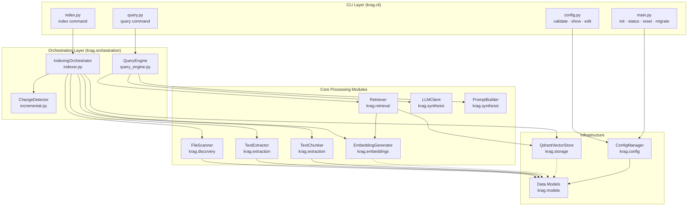
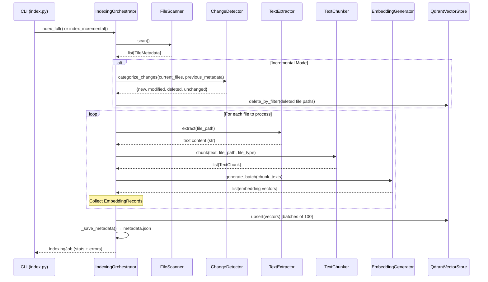
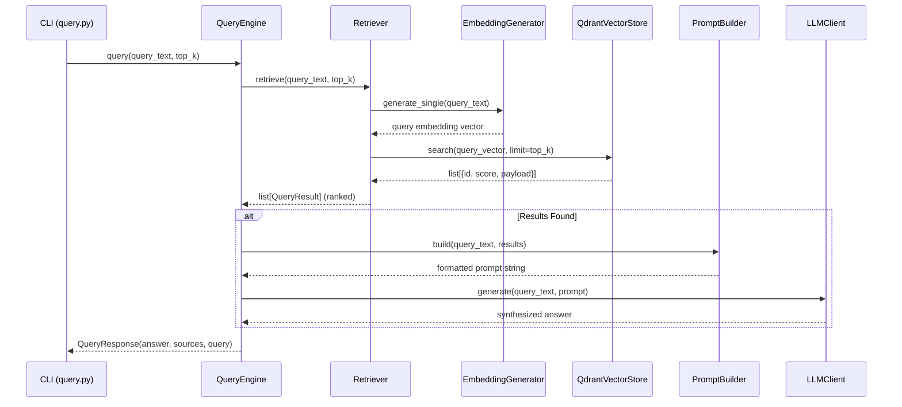
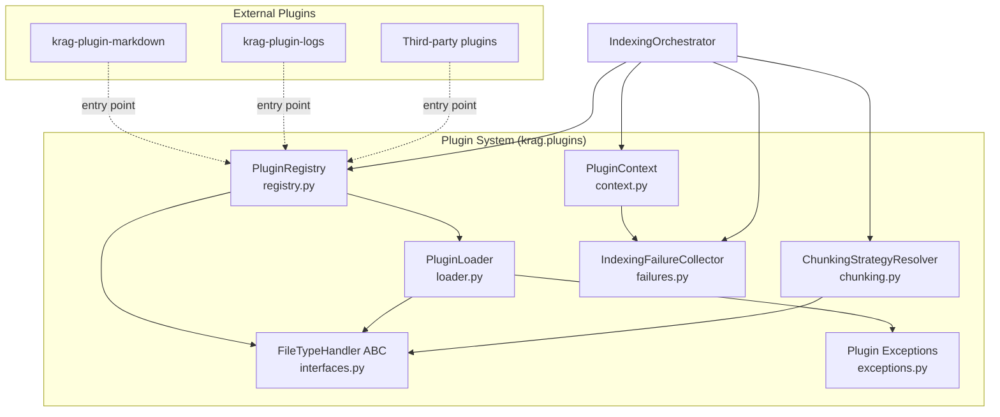
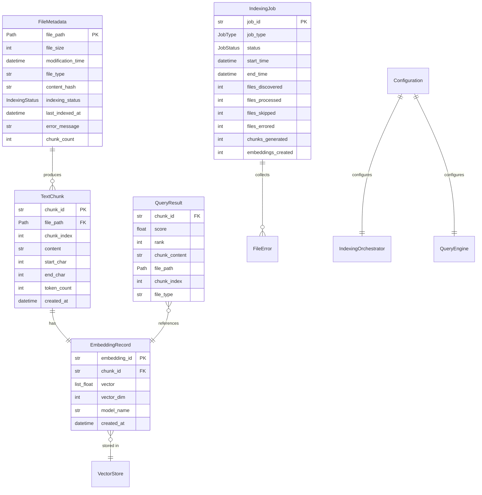
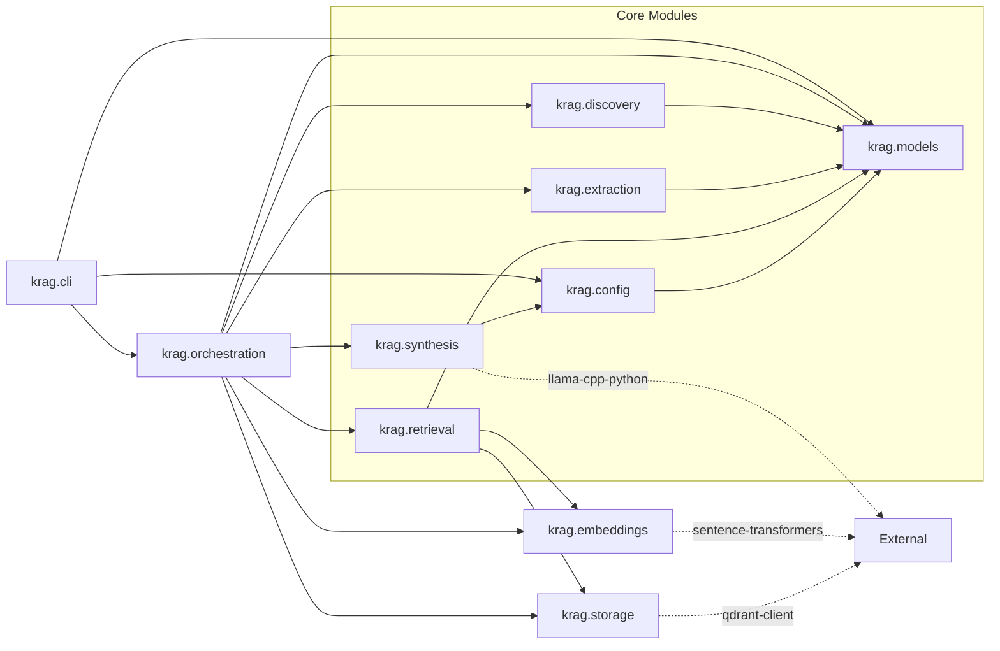

# Architecture: krag

**Version**: 0.1.0  
**Last Updated**: 2026-02-07  
**Scope**: Text-based RAG indexing and retrieval (Phase 1)

---

## Overview

krag is a local-first, personal RAG (Retrieval-Augmented Generation) system. It indexes text-based files from local and network-attached storage, generates vector embeddings, stores them in an embedded Qdrant database, and answers natural language queries by retrieving relevant content and synthesizing answers through a local LLM.

The system operates as a CLI application built with Typer and Rich. All processing runs on-device with no cloud dependencies. The architecture follows a modular pipeline design where each stage has a single responsibility, well-defined inputs and outputs, and can be tested independently.

---

## System Architecture

### High-Level Component Diagram



---

## Directory Structure

```
src/krag/
├── __init__.py              # Package root, exports __version__
├── cli/                     # Command-line interface (Typer + Rich)
│   ├── __init__.py
│   ├── __main__.py          # Entry point for `python -m krag`
│   ├── main.py              # App definition, top-level commands
│   ├── index.py             # `krag index` command
│   ├── query.py             # `krag query` command
│   ├── config.py            # `krag config` sub-commands
│   ├── plugin.py            # `krag plugin` sub-commands
│   └── utils.py             # CLI utilities
├── config/                  # Configuration management
│   ├── __init__.py
│   ├── settings.py          # ConfigManager: load, save, validate, migrate
│   ├── defaults.py          # Default constant values
│   ├── logging.py           # Logging setup (file + console handlers)
│   ├── path_reducer.py      # Path alias resolution for display
│   └── xdg.py              # XDG Base Directory helpers and migration
├── discovery/               # File system scanning
│   ├── __init__.py
│   └── scanner.py           # FileScanner: recursive file discovery
├── extraction/              # Text extraction and chunking
│   ├── __init__.py
│   ├── text_extractor.py    # TextExtractor: file reading + encoding
│   └── chunker.py           # TextChunker: text splitting with overlap
├── embeddings/              # Vector embedding generation
│   ├── __init__.py
│   └── generator.py         # EmbeddingGenerator: sentence-transformers
├── models/                  # Pydantic data models and exceptions
│   ├── __init__.py
│   ├── configuration.py     # Configuration (BaseSettings)
│   ├── file_metadata.py     # FileMetadata, IndexingStatus
│   ├── text_chunk.py        # TextChunk
│   ├── embedding.py         # EmbeddingRecord
│   ├── query_result.py      # QueryResult
│   ├── indexing_job.py      # IndexingJob, JobType, JobStatus, FileError
│   └── exceptions.py        # KragError hierarchy
├── orchestration/           # Pipeline coordination
│   ├── __init__.py
│   ├── indexer.py           # IndexingOrchestrator: full + incremental
│   ├── query_engine.py      # QueryEngine: retrieval + synthesis
│   └── incremental.py       # ChangeDetector: file change categorization
├── retrieval/               # Similarity search
│   ├── __init__.py
│   └── retriever.py         # Retriever: query → ranked results
├── storage/                 # Vector database abstraction
│   ├── __init__.py
│   ├── vector_store.py      # VectorStore ABC
│   └── qdrant_impl.py       # QdrantVectorStore implementation
├── plugins/                 # Plugin system for file type extensions
│   ├── __init__.py
│   ├── registry.py          # PluginRegistry: discovery, lifecycle
│   ├── interfaces.py        # FileTypeHandler ABC, ChunkingStrategy
│   ├── loader.py            # Plugin import and version checking
│   ├── chunking.py          # ChunkingStrategyResolver, CustomChunkerAdapter
│   ├── context.py           # PluginContext: service access for plugins
│   ├── failures.py          # IndexingFailureCollector
│   └── exceptions.py        # Plugin exception hierarchy
└── synthesis/               # LLM answer generation
    ├── __init__.py
    ├── llm_client.py         # LLMClient: local LLM inference
    └── prompt_builder.py     # PromptBuilder: context formatting
```

Each top-level package under `src/krag/` represents a distinct module boundary. Modules communicate through the data models defined in `krag.models` and follow a strict dependency direction: CLI → Orchestration → Core Modules → Infrastructure.

---

## Pipelines

### Indexing Pipeline

The indexing pipeline transforms files on disk into searchable vector embeddings. It is coordinated by `IndexingOrchestrator` in `krag.orchestration.indexer`.



**Stages in detail:**

1. **Discovery** — `FileScanner.scan()` walks configured directories using `Path.rglob("*")`. Applies exclusion patterns (glob matching against path components and parent directories), filters by supported file extensions, skips hidden files (dot-prefix). Produces `FileMetadata` records with SHA-256 content hashes.

2. **Change Detection** (incremental only) — `ChangeDetector.categorize_changes()` compares the current file set against previously indexed metadata loaded from `metadata.json`. Classification logic: file absent → `DELETED`; no prior record → `NEW`; modification time matches within 1ms → `UNCHANGED`; content hash matches despite mtime difference → `UNCHANGED`; hash differs → `MODIFIED`.

3. **Text Extraction** — `TextExtractor.extract()` reads file content with automatic encoding detection (tries UTF-8, falls back to Latin-1). Normalizes whitespace for non-code files. Enforces a configurable maximum file size limit; files exceeding it are skipped.

4. **Chunking** — `TextChunker.chunk()` splits extracted text into overlapping segments. Uses file-type-aware separator hierarchies:
   - **Code**: `\n\n` → `\n` → ` `
   - **Markdown**: `\n## ` → `\n# ` → `\n\n` → `\n` → ` `
   - **Text**: `\n\n` → `. ` → `! ` → `? ` → `\n` → ` `

   Splitting is recursive: if a chunk exceeds `chunk_size`, it is re-split using the next separator in the hierarchy. Overlap of `chunk_overlap` characters is prepended from the previous chunk's tail.

5. **Embedding Generation** — `EmbeddingGenerator.generate_batch()` encodes chunk text into dense vectors using `sentence-transformers`. Default model: `BAAI/bge-base-en-v1.5` (768 dimensions). Embeddings are L2-normalized. Empty text produces a zero vector.

6. **Vector Storage** — `QdrantVectorStore.upsert()` persists embedding vectors with metadata payloads (file path, chunk index, file type, modification time). String UUIDs are converted to integer IDs via SHA-256 hashing for Qdrant compatibility. Upserts are batched in groups of 100.

7. **Metadata Persistence** — After indexing completes, `IndexingOrchestrator._save_metadata()` serializes the `indexed_files` dictionary to `metadata.json` alongside the vector store. This enables incremental indexing across separate CLI invocations.

### Query Pipeline

The query pipeline retrieves relevant content and synthesizes answers. It is coordinated by `QueryEngine` in `krag.orchestration.query_engine`.



**Stages in detail:**

1. **Query Embedding** — The query string is embedded using the same `EmbeddingGenerator` and model used during indexing. This ensures vector space consistency.

2. **Similarity Search** — `Retriever.retrieve()` sends the query vector to `QdrantVectorStore.search()`, which performs approximate nearest neighbor search using HNSW. Returns the top-k most similar vectors with their similarity scores and metadata payloads.

3. **Result Hydration** — Raw search results are converted to `QueryResult` objects with 1-based ranking. Each result includes the chunk content, source file path, chunk index, file type, and cosine similarity score.

4. **Prompt Construction** — `PromptBuilder.build()` assembles a prompt containing:
   - A system instruction defining the assistant's role
   - Retrieved context chunks, each labeled with its source file path (shortened via `PathReducer`)
   - The original query
   - Instructions to base answers on provided context

   Context is truncated to `max_context_length` characters to fit within LLM context window constraints.

5. **Answer Synthesis** — `LLMClient.generate()` passes the assembled prompt to a local GGUF model via `llama-cpp-python`. If no model is loaded (test mode), a fallback method produces a placeholder response summarizing the retrieved context. The CLI supports a `--no-synthesis` flag to return raw retrieval results without LLM invocation.

---

## Module Responsibilities

### `krag.cli` — Command-Line Interface

The CLI is implemented with Typer and Rich. It is a thin presentation layer: it parses arguments, instantiates orchestrators, invokes operations, and formats output. No business logic resides in the CLI.

| Command | Purpose |
|---------|---------|
| `krag init` | Create default configuration file (TOML or YAML) |
| `krag index` | Run full or incremental indexing |
| `krag query` | Query the knowledge base with optional synthesis |
| `krag status` | Display system status and index statistics |
| `krag config validate` | Validate configuration file |
| `krag config show` | Display current configuration |
| `krag config edit` | Open configuration in system editor |
| `krag migrate` | Convert YAML config to TOML format |
| `krag reset` | Remove configuration, data, and/or logs |
| `krag plugin list` | List installed plugins with status |
| `krag plugin info <name>` | Show detailed plugin information |
| `krag plugin enable <name>` | Enable a disabled plugin |
| `krag plugin disable <name>` | Disable an enabled plugin |
| `krag plugin validate` | Check plugin compatibility |
| `krag plugin install` | Install a plugin package |

Global options (`--verbose`, `--show-logs`, `--legacy-paths`, `--version`) are handled by a Typer callback on the main app. Automatic migration from legacy `~/.krag` paths to XDG locations runs on first invocation when legacy data is detected.

### `krag.config` — Configuration Management

`ConfigManager` provides static methods for the configuration lifecycle:

- **`load(path)`** — Auto-detects file format from extension (`.toml` or `.yaml`/`.yml`). TOML files use a section-based layout (`[directories]`, `[embedding]`, `[chunking]`, etc.) that is flattened into `Configuration` model fields.
- **`create_default(path, format)`** — Generates a default configuration file.
- **`validate(config)`** — Checks directory existence, storage path writability, valid distance metric, valid embedding device.
- **`migrate_yaml_to_toml(yaml_path, toml_path)`** — Converts legacy YAML configuration to the section-based TOML format.

`PathReducer` maps absolute paths to shorter display strings using configured aliases (e.g., `/home/ken` → `~`). Aliases are sorted longest-match-first.

XDG Base Directory compliance is handled by `krag.config.xdg`:

| XDG Location | Default Path | Contents |
|---|---|---|
| `XDG_CONFIG_HOME/krag/` | `~/.config/krag/` | `config.toml` |
| `XDG_CACHE_HOME/krag/` | `~/.cache/krag/` | Vector store, embedding models |
| `XDG_STATE_HOME/krag/` | `~/.local/state/krag/` | Log files, `metadata.json` |

A migration utility moves data from the legacy `~/.krag/` layout to XDG-compliant paths using `shutil.move`.

Logging (`krag.config.logging`) configures a `RotatingFileHandler` (10 MB, 5 backups) and an optional console handler. Over ten third-party loggers (`httpx`, `transformers`, `sentence_transformers`, `qdrant_client`, etc.) are suppressed to WARNING level or above unless verbose mode is active.

### `krag.discovery` — File Scanning

`FileScanner` performs recursive directory walking across configured paths. It:

- Iterates with `Path.rglob("*")`
- Excludes hidden files (dot-prefix names)
- Matches exclusion patterns against path components and parent directory names
- Filters by supported file extension set
- Computes SHA-256 content hashes for change detection
- Classifies files as `"code"`, `"markdown"`, or `"text"` based on extension

Output: a list of `FileMetadata` records.

### `krag.extraction` — Text Extraction and Chunking

**`TextExtractor`** reads file content with encoding detection (UTF-8 → Latin-1 fallback). For non-code files, it normalizes whitespace by stripping trailing spaces and collapsing consecutive blank lines. Files exceeding `max_file_size_mb` are rejected.

**`TextChunker`** splits text into overlapping segments using recursive separator-based splitting. The separator hierarchy is chosen by file type. If no separator can split a chunk below `chunk_size`, a hard split at fixed intervals is applied. Overlap is added by prepending the tail of the previous chunk.

Output: a list of `TextChunk` records with UUIDs, character offsets, and token counts.

### `krag.embeddings` — Embedding Generation

`EmbeddingGenerator` wraps `sentence-transformers` (`SentenceTransformer`). It loads the configured model at construction time, suppressing verbose output from the underlying library. Provides:

- `generate_single(text)` — Single text embedding (used for queries)
- `generate_batch(texts, batch_size)` — Batch encoding with optional progress bar (used for indexing)
- `get_dimension()` — Returns model output dimensionality
- `get_model_info()` — Returns model metadata including max sequence length

All embeddings are L2-normalized (`normalize_embeddings=True`).

### `krag.storage` — Vector Database

`VectorStore` is an abstract base class (`ABC`) defining the storage contract:

| Method | Signature | Purpose |
|--------|-----------|---------|
| `upsert` | `(vectors: list[dict])` | Insert or update embedding records |
| `search` | `(query_vector, limit) → list[dict]` | Approximate nearest neighbor search |
| `delete` | `(ids: list[str])` | Remove records by ID |
| `get_stats` | `() → dict` | Collection statistics |

`QdrantVectorStore` implements this contract using `qdrant-client`. It supports both in-memory (`:memory:`) and disk-based storage modes. Key implementation details:

- **ID mapping**: String UUIDs are converted to 64-bit integers via SHA-256 hashing (`_id_to_int`). The original string ID is preserved in the payload as `_original_id`.
- **Filtered deletion**: `delete_by_filter()` uses Qdrant's `FieldCondition`/`Filter` API to delete all vectors matching a given file path, used during incremental re-indexing.
- **Collection management**: Collections are created on first access with the configured vector size and distance metric. `clear()` drops and recreates the collection.

### `krag.retrieval` — Similarity Search

`Retriever` bridges the embedding generator and vector store for query-time retrieval. It generates an embedding for the query text, performs a similarity search, and converts raw results into ranked `QueryResult` objects.

### `krag.synthesis` — LLM Answer Generation

**`PromptBuilder`** assembles structured prompts from query text and retrieved results. Each context chunk is labeled with its source path (shortened via `PathReducer`). Total context is capped at `max_context_length` characters. A separate prompt template handles the no-context case.

**`LLMClient`** manages local LLM inference via `llama-cpp-python`. Model resolution supports:

- **Local GGUF files**: Loaded directly from an absolute path
- **HuggingFace downloads**: Models specified as `org/repo` are downloaded from HuggingFace Hub, with automatic quantization selection (tries `Q2_K` through `Q5_K`, smallest first). Downloaded models are cached in the XDG cache directory.
- **Test mode**: If `model=None`, the client operates without loading a model and produces fallback placeholder responses.

### `krag.orchestration` — Pipeline Coordination

This layer wires together the core processing modules into complete workflows.

**`IndexingOrchestrator`** is the central coordinator for both full and incremental indexing. It:

- Accepts either a `Configuration` object or individual parameters at construction
- Creates and owns instances of `TextExtractor`, `TextChunker`, `EmbeddingGenerator`, `QdrantVectorStore`, and `ChangeDetector`
- Manages `metadata.json` persistence (load on init, save after indexing)
- Filters loaded metadata to only include files within configured directories (workspace isolation)
- Supports context manager protocol (`with` statement) for resource cleanup
- Reports progress via an optional callback function

**`QueryEngine`** coordinates the query pipeline. It owns a `Retriever`, `PromptBuilder`, and reference to an `LLMClient`. It validates input, retrieves results, builds prompts, generates answers, and returns a `QueryResponse` dataclass containing the answer text, source list, and original query.

**`ChangeDetector`** implements incremental indexing logic. It categorizes files into four groups (new, modified, deleted, unchanged) by comparing filesystem state against persisted metadata. Change detection uses a two-tier strategy: modification time comparison first (fast), then content hash comparison (accurate) when mtimes differ.

### `krag.plugins` — Plugin System

The plugin system enables file type handler extensions without modifying core code. Plugins are separate Python packages discovered via entry points and loaded lazily.

**Architecture Overview:**



**Key Components:**

| Component | File | Role |
|-----------|------|------|
| `PluginRegistry` | `registry.py` | Central registry: discovery, loading, lifecycle, extension mapping |
| `PluginLoader` | `loader.py` | Plugin import, instantiation, API version checking |
| `FileTypeHandler` | `interfaces.py` | ABC all plugins must implement |
| `ChunkingStrategy` | `interfaces.py` | Enum for built-in chunking approaches |
| `PluginContext` | `context.py` | Service access object passed to plugins during initialization |
| `ChunkingStrategyResolver` | `chunking.py` | Maps plugin chunking preferences to TextChunker instances |
| `IndexingFailureCollector` | `failures.py` | Aggregates indexing failure records from plugins and core |
| `CustomChunkerAdapter` | `chunking.py` | Wraps `chunk_text()` chunkers to full `TextChunker` interface |

**Plugin Lifecycle:**

1. **Discovery** — `PluginRegistry.discover_plugins()` scans `krag.plugins` entry point group
2. **Extension Mapping** — `_build_extension_map()` creates config-driven extension-to-plugin map
3. **Lazy Loading** — `get_handler_for_extension()` loads plugins on first file access
4. **Initialization** — `PluginLoader.initialize_plugin()` calls `handler.initialize(config, context)`
5. **Processing** — `extract_text()`, `extract_metadata()`, `get_chunking_strategy()` per file
6. **Cleanup** — `PluginLoader.cleanup_plugin()` calls `handler.cleanup()` at shutdown

**Error Handling:** All plugin calls are wrapped in try-catch. On unhandled exception, the plugin is automatically disabled for the remainder of the run. Failures are recorded via `IndexingFailureCollector` and reported in a post-indexing summary.

**API Version:** Plugin API uses semver with major-version compatibility (`PLUGIN_API_VERSION = "1.0.0"`).

---

## Data Model

All data models are implemented as Pydantic `BaseModel` subclasses (or `BaseSettings` for configuration) with field validators and custom serializers for JSON-safe output.

### Entity Relationship Diagram



### Enumerations

| Enum | Values | Used By |
|------|--------|---------|
| `IndexingStatus` | `PENDING`, `COMPLETED`, `FAILED`, `ACCESS_DENIED`, `SKIPPED`, `DELETED`, `UNSUPPORTED` | `FileMetadata` |
| `JobType` | `FULL`, `INCREMENTAL` | `IndexingJob` |
| `JobStatus` | `RUNNING`, `COMPLETED`, `FAILED` | `IndexingJob` |

### Exception Hierarchy

```
KragError (base)
├── ConfigurationError
├── StorageError
├── ModelLoadError
├── IndexingError
├── QueryError
└── FileProcessingError(file_path, message)
```

All exceptions inherit from `KragError`. `FileProcessingError` carries the path of the file that caused the error, enabling per-file error tracking in `IndexingJob.error_summary`.

---

## Data Flow and Persistence

### Storage Locations

| Data | Location | Format |
|------|----------|--------|
| Configuration | `~/.config/krag/config.toml` | TOML (section-based) |
| Vector embeddings | `~/.cache/krag/storage/` | Qdrant embedded database |
| File metadata | `~/.cache/krag/storage/metadata.json` | JSON |
| Embedding models | `~/.cache/krag/models/` | HuggingFace cache |
| LLM models | `~/.cache/krag/models/huggingface/` | GGUF files |
| Log files | `~/.local/state/krag/logs/` | Rotating text files |

All paths respect XDG Base Directory environment variables when set.

### Metadata Persistence Strategy

Indexed file metadata (`FileMetadata` records) is persisted as a JSON file at `{vector_store_path}/metadata.json`. This file is:

- **Loaded** when `IndexingOrchestrator` is constructed, filtered to only include files within configured directories
- **Saved** after each indexing operation (full or incremental) completes
- **Used by** `ChangeDetector` to determine which files are new, modified, deleted, or unchanged

This enables incremental indexing to work correctly across separate CLI invocations without requiring a full database.

### Vector Store Payload Schema

Each vector in Qdrant carries a payload:

```json
{
  "file_path": "/absolute/path/to/file.py",
  "chunk_index": 0,
  "file_type": "code",
  "modification_time": "2026-02-01T12:00:00",
  "_original_id": "uuid-string"
}
```

The `_original_id` field preserves the original string UUID since Qdrant point IDs are stored as 64-bit integers derived from SHA-256 hashing.

---

## Module Dependency Graph



**Dependency invariants:**

- `krag.models` has no intra-project dependencies (except a lazy import of `krag.config.xdg` in `Configuration` default factories)
- Core processing modules depend only on `krag.models` and their respective external libraries
- `krag.orchestration` is the integration layer that depends on all core modules
- `krag.cli` depends on `krag.orchestration` and `krag.config` but not on core modules directly (except for constructing components in some commands)
- No circular dependencies exist between modules

---

## Configuration System

The configuration system supports two file formats with automatic detection:

- **TOML** (primary) — Section-based layout:
  ```toml
  [directories]
  paths = ["/home/user/documents"]

  [embedding]
  model = "BAAI/bge-base-en-v1.5"
  batch_size = 64
  ```

- **YAML** (legacy) — Flat key layout with migration support

`Configuration` extends Pydantic `BaseSettings` and supports environment variable overrides with a `KRAG_` prefix. Default values for all fields are defined in `krag.config.defaults` and reference XDG paths.

Validation checks performed by `ConfigManager.validate()`:

- All configured directories exist on the filesystem
- Vector store path is writable
- Distance metric is one of `cosine`, `dot`, `euclidean`
- Embedding device is one of `cpu`, `cuda`, `mps`
- LLM model path validity is not enforced (model may be downloaded on first use)

---

## Testing Architecture

Tests are organized by scope under the `tests/` directory:

```
tests/
├── unit/                    # Isolated module tests with mocks
├── integration/             # Cross-module workflow tests
├── contract/                # Interface compliance tests
├── fixtures/                # Shared test data and mocks
│   ├── sample_files/        # Test corpus files
│   ├── mock_embeddings.py   # Deterministic embedding generator
│   └── mock_llm.py          # Deterministic LLM client
└── performance/             # Throughput and resource tests
```

### Unit Tests

Unit tests verify individual classes and methods in isolation. External dependencies (filesystem, embedding models, vector stores, LLMs) are replaced with mocks or test doubles.

| Test File | Module Under Test |
|-----------|-------------------|
| `test_discovery.py` | `FileScanner` — file filtering, exclusion patterns, type detection |
| `test_extraction.py` | `TextExtractor` — encoding detection, whitespace normalization |
| `test_chunker.py` | `TextChunker` — splitting strategies, overlap, edge cases |
| `test_configuration.py` | `Configuration` model — field validation, defaults |
| `test_config_manager.py` | `ConfigManager` — load, save, validate operations |
| `test_config_validation.py` | Configuration validation rules |
| `test_config_formats.py` | TOML/YAML format handling and migration |
| `test_prompt_builder.py` | `PromptBuilder` — prompt assembly, context truncation |
| `test_query_engine.py` | `QueryEngine` — query pipeline orchestration |
| `test_incremental.py` | `ChangeDetector` — change classification logic |
| `test_path_reducer.py` | `PathReducer` — alias matching and reduction |
| `test_xdg.py` | XDG path resolution and legacy migration |

### Contract Tests

Contract tests verify that concrete implementations satisfy their abstract interfaces. They test the behavioral contract rather than internal logic.

| Test File | Contract Verified |
|-----------|-------------------|
| `test_vector_store_contract.py` | `QdrantVectorStore` fulfills `VectorStore` ABC (upsert, search, delete, stats) |
| `test_embedding_contract.py` | `EmbeddingGenerator` output format (dimensions, normalization, batch consistency) |
| `test_llm_contract.py` | `LLMClient` response format and error handling |
| `test_retriever_contract.py` | `Retriever` result format (ranking, score range, QueryResult structure) |

### Integration Tests

Integration tests exercise complete workflows across multiple modules with real (or embedded) infrastructure.

| Test File | Workflow Tested |
|-----------|-----------------|
| `test_indexing_pipeline.py` | Full indexing: discovery → extraction → chunking → embedding → storage |
| `test_query_pipeline.py` | Full query: embedding → retrieval → prompt building → synthesis |
| `test_incremental_update.py` | Incremental indexing: detect changes, process only modified files |
| `test_config_filtering.py` | Configuration-driven file filtering during indexing |
| `test_metadata_persistence.py` | Metadata save/load across separate orchestrator instances |
| `test_logging.py` | Logging configuration and output behavior |

### Test Fixtures

- **`mock_embeddings.py`** — Provides a deterministic embedding generator that returns consistent vectors without loading a real model. Used in unit and integration tests to avoid model download overhead.
- **`mock_llm.py`** — Provides a deterministic LLM client that returns predictable responses. Used in query pipeline tests.
- **`sample_files/`** — Contains small test corpus files (Python source, markdown, text) for end-to-end testing.

### Test Configuration

Tests are configured in `pyproject.toml`:

- **Framework**: pytest
- **Coverage**: `--cov=src/krag --cov-report=html --cov-report=term`
- **Type checking**: mypy with strict mode
- **Linting**: ruff with pycodestyle, pyflakes, isort, flake8-bugbear, pyupgrade rules

---

## Key Design Decisions

| Decision | Rationale |
|----------|-----------|
| **Embedded Qdrant** (no server) | Zero service management for single-user desktop use. The embedded Rust core provides full vector search capabilities without running a separate process. |
| **sentence-transformers for embeddings** | Most mature Python embedding library with broad model selection. Default model (`BAAI/bge-base-en-v1.5`, 768-dim) provides strong retrieval quality for both natural language and code content. |
| **llama-cpp-python for LLM** | Efficient local inference via the llama.cpp C++ backend. Supports quantized GGUF models for reduced memory footprint. No separate service required. |
| **Pydantic for data models** | Runtime validation, serialization, and type safety. `BaseSettings` integration provides environment variable support for configuration. |
| **SHA-256 content hashing** | Reliable change detection for incremental indexing. Prevents unnecessary re-indexing when files are moved (changing mtime) without content modification. |
| **JSON for metadata persistence** | Simple, human-readable format for the `metadata.json` file. Adequate for the current scale (tens of thousands of file records). |
| **Recursive separator-based chunking** | File-type-aware splitting preserves semantic boundaries (function definitions, markdown headings, sentence breaks) better than fixed-size splitting. |
| **XDG Base Directory compliance** | Standard Linux/macOS convention for config, cache, and state separation. Automatic migration from the legacy `~/.krag` layout. |
| **TOML as primary config format** | Standard Python ecosystem format (PEP 518). Section-based layout improves readability over flat YAML. YAML retained for backward compatibility with migration tooling. |
| **VectorStore ABC** | Decouples storage logic from the rest of the system. Enables testing with in-memory stores and future swap to alternative backends. |

---

## Technology Stack

| Component | Technology | Version Requirement |
|-----------|-----------|---------------------|
| Language | Python | ≥ 3.11 |
| CLI Framework | Typer + Rich | ≥ 0.9.0 / ≥ 13.0.0 |
| Data Models | Pydantic + pydantic-settings | ≥ 2.0.0 |
| Embeddings | sentence-transformers | ≥ 2.2.0 |
| Vector Store | qdrant-client (embedded) | ≥ 1.7.0 |
| LLM Inference | llama-cpp-python | ≥ 0.2.0 |
| Text Chunking | llama-index | ≥ 0.9.0 |
| Config Format | tomli-w / tomllib (stdlib) | ≥ 1.0.0 |
| Legacy Config | PyYAML | ≥ 6.0.0 |
| Package Manager | uv | — |
| Linting/Formatting | ruff | ≥ 0.1.0 |
| Testing | pytest + pytest-cov | ≥ 7.4.0 |
| Type Checking | mypy (strict) | ≥ 1.5.0 |
| Build Backend | hatchling | — |
