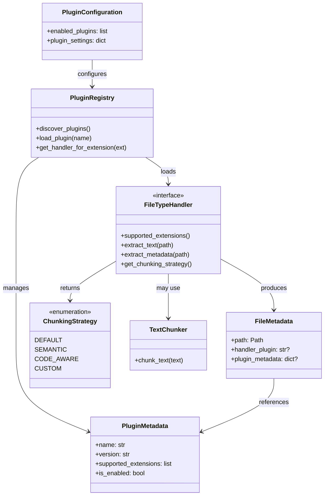

# Data Model: Plugin Architecture for File Type Extensions

**Feature**: 002-plugin-architecture  
**Date**: 2026-02-07  
**Status**: Phase 1 Design

## Overview

The plugin architecture introduces new entities for plugin management, file type handling, and chunking strategy selection. These entities integrate with existing krag data models (FileMetadata, TextChunk, Configuration) to enable seamless plugin-based file processing.

## Core Entities

### 1. PluginMetadata

Represents metadata about an installed plugin discovered via entry points.

**Attributes**:
- `name: str` - Plugin identifier (e.g., "pdf", "docx")
- `version: str` - Plugin version from package metadata
- `entry_point: str` - Full entry point reference (e.g., "krag_plugin_pdf.handler:PDFFileTypeHandler")
- `supported_extensions: list[str]` - File extensions this plugin handles (e.g., [".pdf", ".PDF"])
- `description: str | None` - Human-readable plugin description
- `author: str | None` - Plugin author from package metadata
- `required_api_version: str` - Minimum plugin API version required
- `is_enabled: bool` - Whether plugin is currently enabled (from configuration)
- `is_loaded: bool` - Whether plugin has been imported and instantiated
- `load_error: str | None` - Error message if plugin failed to load

**Validation Rules**:
- `name` must be valid Python identifier (alphanumeric + underscore)
- `version` must be valid semantic version string
- `supported_extensions` must not be empty
- `required_api_version` must match supported API version range using **semver major-version compatibility**: plugins are compatible with the same major version of the plugin API (e.g., a plugin requiring `1.2.0` works with API `1.5.0`, but not `2.0.0`). Breaking changes increment the major version.

**Relationships**:
- One PluginMetadata → Many FileMetadata (plugin processes files)
- PluginMetadata references → PluginConfiguration (plugin-specific settings)

---

### 2. FileTypeHandler (Interface)

Abstract base class that all file type plugins must implement.

**Methods**:
- `supported_extensions() -> list[str]` - Returns list of extensions (e.g., [".pdf"])
- `extract_text(file_path: Path) -> str` - Extracts plain text content
- `extract_metadata(file_path: Path) -> dict[str, Any]` - Extracts file-specific metadata
- `get_chunking_strategy() -> ChunkingStrategy | TextChunker | None` - Returns chunking preference

**Properties**:
- `name: str` - Plugin identifier
- `version: str` - Plugin version
- `required_api_version: str` - Minimum API version

**Lifecycle Hooks** (optional):
- `initialize(config: dict[str, Any]) -> None` - Called once after loading
- `cleanup() -> None` - Called at shutdown for resource cleanup
- `config_schema() -> type[BaseModel] | None` - Returns Pydantic model class for validating plugin-specific settings. If provided, `PluginConfiguration` validates the plugin's settings against this model before calling `initialize()`. Returns `None` if plugin has no configurable settings.

**Error Handling**:
- Raises `PluginExtractionError` if file cannot be processed
- Raises `PluginConfigurationError` if configuration is invalid

---

### 3. ChunkingStrategy (Enum)

Defines available built-in chunking strategies that plugins can select.

**Values**:
- `DEFAULT` - Use krag's default TextChunker (current behavior)
- `SEMANTIC` - Reserved for future semantic boundary detection
- `CODE_AWARE` - Reserved for future code-structure-aware chunking
- `CUSTOM` - Plugin provides custom chunker instance

**Usage**:
```python
# Plugin specifies strategy
def get_chunking_strategy(self) -> ChunkingStrategy | TextChunker | None:
    return ChunkingStrategy.DEFAULT  # Use krag's chunker
    # OR
    return MyCustomChunker(...)      # Provide custom implementation
    # OR
    return None                       # Same as DEFAULT
```

---

### 4. PluginConfiguration

Pydantic model for plugin-specific configuration in main config.toml.

**Attributes**:
- `enabled_plugins: list[str]` - List of plugin names to enable (default: all discovered)
- `disabled_plugins: list[str]` - List of plugin names to explicitly disable
- `plugin_settings: dict[str, dict[str, Any]]` - Per-plugin configuration

**Example Configuration**:
```toml
[plugins]
enabled = ["pdf", "docx"]
disabled = []

[plugins.pdf]
extract_images = false
ocr_enabled = false
max_pages = 1000

[plugins.docx]
extract_comments = true
include_headers_footers = true
```

**Validation Rules**:
- `enabled_plugins` and `disabled_plugins` cannot have overlapping entries
- Plugin names must match discovered plugins
- Per-plugin settings validated against plugin's `config_schema()` Pydantic model (if provided by the plugin). When a plugin defines `config_schema()`, its settings from config.toml are validated against the returned Pydantic model before `initialize()` is called. Validation errors disable the plugin with a logged warning.

---

### 5. PluginRegistry

Central registry that manages plugin discovery, loading, and lifecycle.

**Attributes**:
- `_discovered: dict[str, PluginMetadata]` - All discovered plugins
- `_loaded: dict[str, FileTypeHandler]` - Loaded plugin instances
- `_extension_map: dict[str, str]` - File extension → plugin name mapping
- `_config: PluginConfiguration` - Plugin configuration
- `_api_version: str` - Current plugin API version

**Methods**:
- `discover_plugins() -> list[PluginMetadata]` - Scan entry points for installed plugin packages
- `validate_plugins() -> list[str]` - Check API version compatibility and attempt import
- `load_plugin(name: str) -> FileTypeHandler` - Import, instantiate, and initialize plugin
- `get_handler_for_extension(ext: str) -> FileTypeHandler | None` - Retrieve handler (lazy load on first access)
- `unload_plugin(name: str) -> None` - Cleanup and unload plugin
- `list_plugins(filter: str | None) -> list[PluginMetadata]` - List plugins by filter
- `add_plugin(name: str) -> PluginMetadata` - Discover installed plugin package, query file types, add to config
- `remove_plugin(name: str) -> None` - Remove plugin entry from configuration
- `enable_plugin(name: str) -> None` - Enable plugin in configuration
- `disable_plugin(name: str) -> None` - Disable plugin in configuration and unload

**State Transitions**:
1. **Discovered** → Plugin found via entry point, metadata loaded
2. **Validated** → Compatibility checked, dependencies verified
3. **Loaded** → Module imported, handler instantiated
4. **Initialized** → Configuration applied, ready for use
5. **Error** → Load or validation failed, marked unavailable
6. **Disabled** → Plugin disabled by user or by runtime error (see FR-008)

---

### 6. PluginError Hierarchy

Exception types for plugin system error handling.

**Base Exception**:
- `PluginError(KragError)` - Base class for all plugin errors

**Specific Exceptions**:
- `PluginNotFoundError` - Requested plugin not installed
- `PluginLoadError` - Failed to import or instantiate plugin
- `PluginConfigurationError` - Invalid plugin configuration
- `PluginExtractionError` - Plugin failed to extract content from file
- `PluginAPIVersionError` - Plugin requires unsupported API version
- `PluginDependencyError` - Plugin missing required dependencies
- `PluginDisabledError` - Plugin was disabled during runtime due to failure

**Error Attributes**:
- `plugin_name: str` - Name of plugin that raised error
- `file_path: Path | None` - File being processed (if applicable)
- `original_exception: Exception | None` - Underlying exception

---

### 7. PluginContext

Context object passed to plugins providing access to krag's core capabilities (see FR-009).

**Attributes**:
- `embedding_generator: EmbeddingGenerator` - Access to krag's embedding generation service
- `vector_store: VectorStore` - Access to krag's vector storage for query/upsert operations
- `chunker: TextChunker` - Access to krag's default text chunker
- `logger: Logger` - Plugin-scoped structured logger
- `report_indexing_failure: Callable[[Path, str], None]` - Failure-to-index reporting API (see FR-014)

**Usage**:
```python
# Passed to plugin during initialization
def initialize(self, config: dict[str, Any], context: PluginContext) -> None:
    self._context = context

# Plugin can report files it cannot process
def extract_text(self, file_path: Path) -> str:
    try:
        return self._do_extraction(file_path)
    except CorruptedFileError:
        self._context.report_indexing_failure(file_path, "File is corrupted")
        return ""
```

**Notes**:
- PluginContext is created by the orchestrator and passed to `initialize()`
- Plugins that only need text extraction/metadata do not need to use context services
- The `report_indexing_failure()` function is also available to the core system for its own failures

---

### 8. IndexingFailureRecord

Records files that could not be indexed, for user reporting (see FR-014).

**Attributes**:
- `file_path: Path` - Path of the file that failed
- `plugin_name: str | None` - Plugin that reported the failure (None for core system)
- `reason: str` - Human-readable failure description
- `timestamp: datetime` - When the failure occurred
- `exception_type: str | None` - Exception class name if caused by exception

**Usage**:
- Collected during indexing runs
- Summarized in post-indexing output
- Queryable via CLI command (e.g., `krag index --show-failures` or `krag plugin failures`)

---

## Modified Existing Entities

### FileMetadata (Extended)

Add plugin-related fields to existing FileMetadata model.

**New Attributes**:
- `handler_plugin: str | None` - Name of plugin that processed this file (None for built-in text extractor)
- `plugin_metadata: dict[str, Any] | None` - Plugin-specific metadata extracted from file

**Example**:
```python
FileMetadata(
    path=Path("/docs/manual.pdf"),
    size_bytes=1024000,
    last_modified=datetime(...),
    handler_plugin="pdf",  # NEW
    plugin_metadata={      # NEW
        "page_count": 42,
        "author": "Jane Doe",
        "pdf_version": "1.7"
    },
    ...
)
```

---

### Configuration (Extended)

Add plugin configuration section to existing Configuration model.

**New Attribute**:
- `plugins: PluginConfiguration` - Plugin system configuration

**Example**:
```python
Configuration(
    indexing=IndexingConfiguration(...),
    retrieval=RetrievalConfiguration(...),
    plugins=PluginConfiguration(  # NEW
        enabled_plugins=["pdf", "docx"],
        disabled_plugins=[],
        plugin_settings={
            "pdf": {"max_pages": 1000},
            "docx": {"extract_comments": True}
        }
    )
)
```

---

## Entity Relationships



---

## Data Flow

### Plugin Discovery and Registration

```
1. User installs plugin package (`uv pip install krag-plugin-pdf`)
   ↓
2. User runs `krag plugin add pdf`
   ↓
3. PluginRegistry.add_plugin("pdf")
   ↓
4. Scan entry points → Find plugin → Query supported_extensions()
   ↓
5. Write plugin entry + file type mappings to config.toml
   ↓
6. Plugin is now configured (but not loaded)
```

### Runtime Plugin Loading (Lazy)

```
1. User runs `krag index <directory>`
   ↓
2. Read plugin configuration from config.toml (extension → plugin mappings)
   ↓
3. Scanner encounters file.pdf
   ↓
4. Check extension_map: ".pdf" → "pdf" plugin
   ↓
5. Lazy load: import plugin module → instantiate → validate API version → initialize(config, context)
   ↓
6. handler.extract_text(file.pdf) → text  [wrapped in try-catch]
   ↓
7. handler.extract_metadata(file.pdf) → metadata  [wrapped in try-catch]
   ↓
8. handler.get_chunking_strategy() → ChunkingStrategy or TextChunker
   ↓
9. Apply chunking strategy → TextChunks
   ↓
10. Create FileMetadata with handler_plugin="pdf"
   ↓
11. Continue indexing pipeline
```

### Plugin Error During Processing

```
1. Plugin raises unhandled exception during extract_text() or extract_metadata()
   ↓
2. Catch exception → Log error with context
   ↓
3. Record via report_indexing_failure(file_path, reason)
   ↓
4. Disable plugin for remainder of run
   ↓
5. Skip remaining files for this plugin's extensions
   ↓
6. Continue processing with other enabled plugins
   ↓
7. Include failure summary in post-indexing output
```

---

## State Persistence

### Configuration Persistence

Plugin configuration stored in `~/.config/krag/config.toml`:
```toml
[plugins]
enabled = ["pdf", "docx"]

[plugins.pdf]
max_pages = 1000
```

### Runtime State (Not Persisted)

- Plugin load status (loaded/not loaded)
- Plugin instances (in-memory only)
- Extension map (rebuilt on startup)

### Indexed File Metadata (Persisted)

FileMetadata includes `handler_plugin` field stored in Qdrant:
- Enables filtering by plugin
- Supports plugin change detection
- Enables re-indexing when plugin upgraded

---

## Validation Rules Summary

### Plugin Discovery
- Plugin name must be unique
- Entry point must be valid Python import path
- Supported extensions must not conflict with other enabled plugins

### Plugin Loading
- Plugin API version must be compatible (semver major-version: `1.x.x` compatible with current `1.0.0`, `2.x.x` not compatible)
- Plugin dependencies must be installed (verified by attempting import)
- All plugin calls wrapped in try-catch; unhandled exceptions disable the plugin for the current run
- Plugin must implement all required FileTypeHandler methods

### Configuration
- enabled_plugins and disabled_plugins must not overlap
- Plugin-specific settings validated against plugin's `config_schema()` Pydantic model (if provided)
- File extension mappings must be unambiguous; conflicts resolved by config file order with per-extension overrides

### File Processing
- File must have supported extension
- Plugin must successfully extract text (may be empty string)
- Metadata dictionary may be empty but must be valid dict
- Chunking strategy must be valid enum or TextChunker instance

---

## Future Extensions

### Planned for Later Versions
- **Plugin dependency resolution**: Handle inter-plugin dependencies
- **Plugin marketplace**: Centralized plugin discovery
- **Plugin sandboxing**: Security constraints on plugin operations
- **Streaming extraction**: Support large file processing without full load
- **Multi-format handlers**: Single plugin supporting multiple related formats
- **Resource limits**: Memory and processing time constraints for plugin operations

---

## Example: PDF Plugin Data Flow

```python
# Plugin discovery
metadata = PluginMetadata(
    name="pdf",
    version="1.0.0",
    entry_point="krag_plugin_pdf.handler:PDFFileTypeHandler",
    supported_extensions=[".pdf", ".PDF"],
    required_api_version="1.0.0",
    is_enabled=True,
    is_loaded=False
)

# Plugin loading
handler = PDFFileTypeHandler()
handler.initialize(config={"max_pages": 1000})

# File processing
text = handler.extract_text(Path("/docs/paper.pdf"))
metadata = handler.extract_metadata(Path("/docs/paper.pdf"))
# metadata = {"page_count": 12, "author": "John Doe", "title": "Research Paper"}

strategy = handler.get_chunking_strategy()  # Returns ChunkingStrategy.DEFAULT

# File metadata creation
file_meta = FileMetadata(
    path=Path("/docs/paper.pdf"),
    size_bytes=524288,
    last_modified=datetime(2026, 2, 7, 10, 30),
    handler_plugin="pdf",
    plugin_metadata={"page_count": 12, "author": "John Doe"}
)
```
