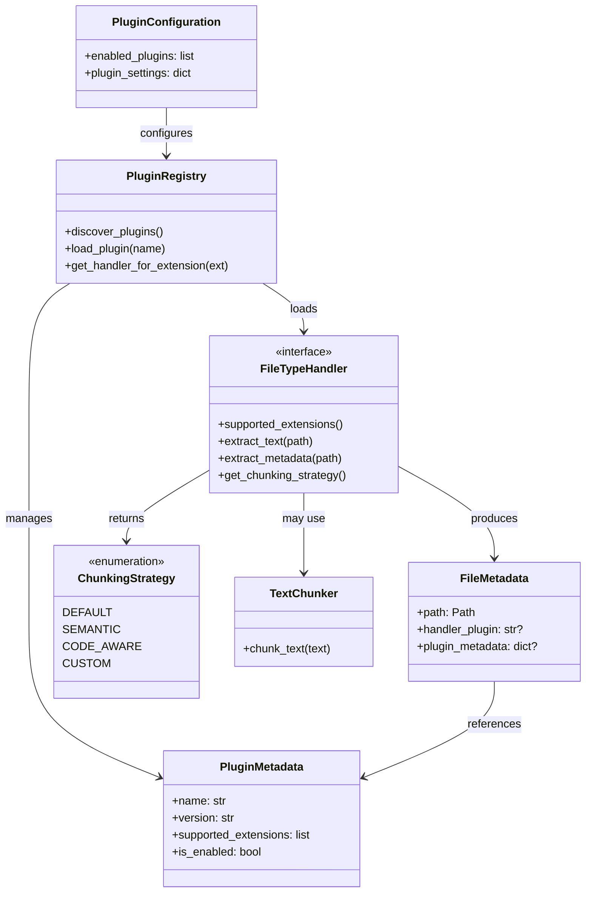

# Data Model: Plugin Architecture for File Type Extensions

**Feature**: 002-plugin-architecture  
**Date**: 2026-02-07  
**Status**: Phase 1 Design

## Overview

The plugin architecture introduces new entities for plugin management, file type handling, and chunking strategy selection. These entities integrate with existing krag data models (FileMetadata, TextChunk, Configuration) to enable seamless plugin-based file processing.

## Core Entities

### 1. PluginMetadata

Represents metadata about an installed plugin discovered via entry points.

**Attributes**:
- `name: str` - Plugin identifier (e.g., "pdf", "docx")
- `version: str` - Plugin version from package metadata
- `entry_point: str` - Full entry point reference (e.g., "krag_plugin_pdf.handler:PDFFileTypeHandler")
- `supported_extensions: list[str]` - File extensions this plugin handles (e.g., [".pdf", ".PDF"])
- `description: str | None` - Human-readable plugin description
- `author: str | None` - Plugin author from package metadata
- `required_api_version: str` - Minimum plugin API version required
- `is_enabled: bool` - Whether plugin is currently enabled (from configuration)
- `is_loaded: bool` - Whether plugin has been imported and instantiated
- `load_error: str | None` - Error message if plugin failed to load

**Validation Rules**:
- `name` must be valid Python identifier (alphanumeric + underscore)
- `version` must be valid semantic version string
- `supported_extensions` must not be empty
- `required_api_version` must match supported API version range

**Relationships**:
- One PluginMetadata → Many FileMetadata (plugin processes files)
- PluginMetadata references → PluginConfiguration (plugin-specific settings)

---

### 2. FileTypeHandler (Interface)

Abstract base class that all file type plugins must implement.

**Methods**:
- `supported_extensions() -> list[str]` - Returns list of extensions (e.g., [".pdf"])
- `extract_text(file_path: Path) -> str` - Extracts plain text content
- `extract_metadata(file_path: Path) -> dict[str, Any]` - Extracts file-specific metadata
- `get_chunking_strategy() -> ChunkingStrategy | TextChunker | None` - Returns chunking preference

**Properties**:
- `name: str` - Plugin identifier
- `version: str` - Plugin version
- `required_api_version: str` - Minimum API version

**Lifecycle Hooks** (optional):
- `initialize(config: dict[str, Any]) -> None` - Called once after loading
- `cleanup() -> None` - Called at shutdown for resource cleanup

**Error Handling**:
- Raises `PluginExtractionError` if file cannot be processed
- Raises `PluginConfigurationError` if configuration is invalid

---

### 3. ChunkingStrategy (Enum)

Defines available built-in chunking strategies that plugins can select.

**Values**:
- `DEFAULT` - Use krag's default TextChunker (current behavior)
- `SEMANTIC` - Reserved for future semantic boundary detection
- `CODE_AWARE` - Reserved for future code-structure-aware chunking
- `CUSTOM` - Plugin provides custom chunker instance

**Usage**:
```python
# Plugin specifies strategy
def get_chunking_strategy(self) -> ChunkingStrategy | TextChunker | None:
    return ChunkingStrategy.DEFAULT  # Use krag's chunker
    # OR
    return MyCustomChunker(...)      # Provide custom implementation
    # OR
    return None                       # Same as DEFAULT
```

---

### 4. PluginConfiguration

Pydantic model for plugin-specific configuration in main config.toml.

**Attributes**:
- `enabled_plugins: list[str]` - List of plugin names to enable (default: all discovered)
- `disabled_plugins: list[str]` - List of plugin names to explicitly disable
- `plugin_settings: dict[str, dict[str, Any]]` - Per-plugin configuration

**Example Configuration**:
```toml
[plugins]
enabled = ["pdf", "docx"]
disabled = []

[plugins.pdf]
extract_images = false
ocr_enabled = false
max_pages = 1000

[plugins.docx]
extract_comments = true
include_headers_footers = true
```

**Validation Rules**:
- `enabled_plugins` and `disabled_plugins` cannot have overlapping entries
- Plugin names must match discovered plugins
- Per-plugin settings validated against plugin's config schema (if provided)

---

### 5. PluginRegistry

Central registry that manages plugin discovery, loading, and lifecycle.

**Attributes**:
- `_discovered: dict[str, PluginMetadata]` - All discovered plugins
- `_loaded: dict[str, FileTypeHandler]` - Loaded plugin instances
- `_extension_map: dict[str, str]` - File extension → plugin name mapping
- `_config: PluginConfiguration` - Plugin configuration
- `_api_version: str` - Current plugin API version

**Methods**:
- `discover_plugins() -> list[PluginMetadata]` - Scan entry points
- `validate_plugins() -> list[str]` - Check compatibility and dependencies
- `load_plugin(name: str) -> FileTypeHandler` - Load and initialize plugin
- `get_handler_for_extension(ext: str) -> FileTypeHandler | None` - Retrieve handler
- `reload_plugin(name: str) -> None` - Reload plugin (for development)
- `unload_plugin(name: str) -> None` - Cleanup and unload plugin
- `list_plugins(filter: str | None) -> list[PluginMetadata]` - List plugins by filter

**State Transitions**:
1. **Discovered** → Plugin found via entry point, metadata loaded
2. **Validated** → Compatibility checked, dependencies verified
3. **Loaded** → Module imported, handler instantiated
4. **Initialized** → Configuration applied, ready for use
5. **Error** → Load or validation failed, marked unavailable

---

### 6. PluginError Hierarchy

Exception types for plugin system error handling.

**Base Exception**:
- `PluginError(KragError)` - Base class for all plugin errors

**Specific Exceptions**:
- `PluginNotFoundError` - Requested plugin not installed
- `PluginLoadError` - Failed to import or instantiate plugin
- `PluginConfigurationError` - Invalid plugin configuration
- `PluginExtractionError` - Plugin failed to extract content from file
- `PluginAPIVersionError` - Plugin requires unsupported API version
- `PluginDependencyError` - Plugin missing required dependencies

**Error Attributes**:
- `plugin_name: str` - Name of plugin that raised error
- `file_path: Path | None` - File being processed (if applicable)
- `original_exception: Exception | None` - Underlying exception

---

## Modified Existing Entities

### FileMetadata (Extended)

Add plugin-related fields to existing FileMetadata model.

**New Attributes**:
- `handler_plugin: str | None` - Name of plugin that processed this file (None for built-in text extractor)
- `plugin_metadata: dict[str, Any] | None` - Plugin-specific metadata extracted from file

**Example**:
```python
FileMetadata(
    path=Path("/docs/manual.pdf"),
    size_bytes=1024000,
    last_modified=datetime(...),
    handler_plugin="pdf",  # NEW
    plugin_metadata={      # NEW
        "page_count": 42,
        "author": "Jane Doe",
        "pdf_version": "1.7"
    },
    ...
)
```

---

### Configuration (Extended)

Add plugin configuration section to existing Configuration model.

**New Attribute**:
- `plugins: PluginConfiguration` - Plugin system configuration

**Example**:
```python
Configuration(
    indexing=IndexingConfiguration(...),
    retrieval=RetrievalConfiguration(...),
    plugins=PluginConfiguration(  # NEW
        enabled_plugins=["pdf", "docx"],
        disabled_plugins=[],
        plugin_settings={
            "pdf": {"max_pages": 1000},
            "docx": {"extract_comments": True}
        }
    )
)
```

---

## Entity Relationships



---

## Data Flow

### Plugin Discovery and Loading

```
1. Startup
   ↓
2. PluginRegistry.discover_plugins()
   ↓
3. Scan entry points → Create PluginMetadata for each
   ↓
4. Load PluginConfiguration from config.toml
   ↓
5. Validate plugins (API version, dependencies)
   ↓
6. Build extension_map (extension → plugin_name)
   ↓
7. Registry ready (plugins not yet loaded)
```

### File Processing with Plugin

```
1. Scanner encounters file.pdf
   ↓
2. Registry.get_handler_for_extension(".pdf")
   ↓
3. Check if "pdf" plugin loaded
   ↓
4. If not: load_plugin("pdf") → Import → Initialize
   ↓
5. handler.extract_text(file.pdf) → text
   ↓
6. handler.extract_metadata(file.pdf) → metadata
   ↓
7. handler.get_chunking_strategy() → ChunkingStrategy or TextChunker
   ↓
8. Apply chunking strategy → TextChunks
   ↓
9. Create FileMetadata with handler_plugin="pdf"
   ↓
10. Continue indexing pipeline
```

---

## State Persistence

### Configuration Persistence

Plugin configuration stored in `~/.config/krag/config.toml`:
```toml
[plugins]
enabled = ["pdf", "docx"]

[plugins.pdf]
max_pages = 1000
```

### Runtime State (Not Persisted)

- Plugin load status (loaded/not loaded)
- Plugin instances (in-memory only)
- Extension map (rebuilt on startup)

### Indexed File Metadata (Persisted)

FileMetadata includes `handler_plugin` field stored in Qdrant:
- Enables filtering by plugin
- Supports plugin change detection
- Enables re-indexing when plugin upgraded

---

## Validation Rules Summary

### Plugin Discovery
- Plugin name must be unique
- Entry point must be valid Python import path
- Supported extensions must not conflict with other enabled plugins

### Plugin Loading
- Plugin API version must be compatible (`1.x.x` for current `1.0.0`)
- Plugin dependencies must be installed
- Plugin must implement all required FileTypeHandler methods

### Configuration
- enabled_plugins and disabled_plugins must not overlap
- Plugin-specific settings must be valid for that plugin
- File extension mappings must be unambiguous

### File Processing
- File must have supported extension
- Plugin must successfully extract text (may be empty string)
- Metadata dictionary may be empty but must be valid dict
- Chunking strategy must be valid enum or TextChunker instance

---

## Future Extensions

### Planned for Later Versions
- **Plugin dependency resolution**: Handle inter-plugin dependencies
- **Plugin marketplace**: Centralized plugin discovery
- **Plugin sandboxing**: Security constraints on plugin operations
- **Streaming extraction**: Support large file processing without full load
- **Multi-format handlers**: Single plugin supporting multiple related formats

---

## Example: PDF Plugin Data Flow

```python
# Plugin discovery
metadata = PluginMetadata(
    name="pdf",
    version="1.0.0",
    entry_point="krag_plugin_pdf.handler:PDFFileTypeHandler",
    supported_extensions=[".pdf", ".PDF"],
    required_api_version="1.0.0",
    is_enabled=True,
    is_loaded=False
)

# Plugin loading
handler = PDFFileTypeHandler()
handler.initialize(config={"max_pages": 1000})

# File processing
text = handler.extract_text(Path("/docs/paper.pdf"))
metadata = handler.extract_metadata(Path("/docs/paper.pdf"))
# metadata = {"page_count": 12, "author": "John Doe", "title": "Research Paper"}

strategy = handler.get_chunking_strategy()  # Returns ChunkingStrategy.DEFAULT

# File metadata creation
file_meta = FileMetadata(
    path=Path("/docs/paper.pdf"),
    size_bytes=524288,
    last_modified=datetime(2026, 2, 7, 10, 30),
    handler_plugin="pdf",
    plugin_metadata={"page_count": 12, "author": "John Doe"}
)
```
