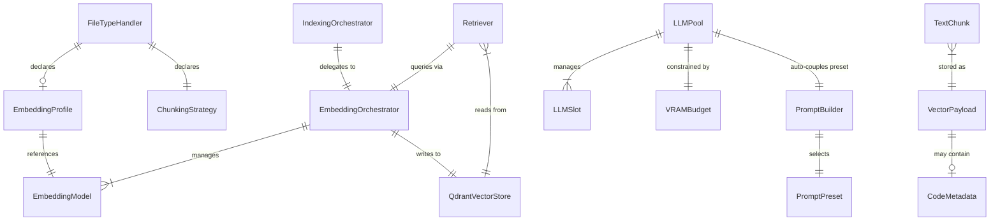

# Data Model: Code-Aware Indexing

**Feature**: 005-code-aware-indexing  
**Date**: 2026-02-16

## Entity Relationship Diagram



## Entities

### 1. CodeMetadata (new — embedded in vector store payload)

Code-specific metadata produced by the code plugin's AST chunker and stored in the Qdrant vector payload. Not a separate Pydantic model — it's additional fields in the payload dict.

| Field | Type | Description | Example |
|-------|------|-------------|---------|
| `language` | `str` | Programming language | `"python"` |
| `function_name` | `str \| None` | Function/method name if chunk is a function | `"_deduplicate"` |
| `class_name` | `str \| None` | Parent class name if chunk is a method | `"Retriever"` |
| `start_line` | `int` | 1-based start line in source file | `45` |
| `end_line` | `int` | 1-based end line in source file | `68` |
| `node_type` | `str` | Tree-sitter node type | `"function_definition"` |
| `has_decorators` | `bool` | Whether the definition has decorators | `true` |
| `imports` | `list[str]` | Import statements relevant to this chunk | `["from pathlib import Path"]` |

**Source**: Produced by `CodeFileHandler.extract_metadata()` and `ASTChunker.chunk()`. Injected into vector payload during indexing.

**Validation rules**: `language` is required. All other fields are optional (may be `None` for non-function chunks like import blocks). `start_line` and `end_line` are 1-based (tree-sitter reports 0-based; convert on output).

---

### 2. SemanticUnit (new — internal to code plugin)

Intermediate representation of a parsed AST node. Internal to the code plugin, never stored.

```python
@dataclass(frozen=True)
class SemanticUnit:
    """A parsed code construct from tree-sitter."""
    node_type: str           # "function_definition", "class_definition", etc.
    name: str | None         # Function/class name, or None for import blocks
    source_text: str         # Full source text of this unit
    start_line: int          # 0-based (raw tree-sitter)
    end_line: int            # 0-based (raw tree-sitter)
    start_byte: int          # Byte offset in source file
    end_byte: int            # Byte offset in source file
    parent_class: str | None # Parent class name for methods
    decorators: list[str]    # Decorator strings (e.g., ["@staticmethod"])
    has_error: bool          # True if subtree contains ERROR nodes
    children: list["SemanticUnit"]  # For classes: methods as children
```

**Lifecycle**: Created by `ASTChunker._extract_semantic_units()`, consumed by `ASTChunker._units_to_chunks()`, then discarded.

---

### 3. EmbeddingProfile (new — returned by plugin)

A plugin's declaration of its preferred embedding model. Returned from `FileTypeHandler.get_embedding_model()`.

| Field | Type | Description | Example |
|-------|------|-------------|---------|
| `model_name` | `str` | HuggingFace model name or local path | `"jinaai/jina-embeddings-v2-base-code"` |
| `vector_name` | `str` | Named vector key in Qdrant collection | `"code"` |

**Note**: This is a simple return value, not a Pydantic model. Plugins return a `str` (model name) from `get_embedding_model()`. The `EmbeddingOrchestrator` maps model names to vector namespace names via a lookup table.

**Default behavior**: Plugins that return `None` from `get_embedding_model()` use the system default model and the `"text"` vector namespace.

---

### 4. EmbeddingOrchestrator (new class in `src/krag/embeddings/orchestrator.py`)

Manages multiple embedding models and routes files/queries to the correct model.

```python
class EmbeddingOrchestrator:
    """Manages multiple embedding models for plugin-declared routing."""
    
    # State
    _models: dict[str, EmbeddingGenerator]   # vector_name → generator
    _model_names: dict[str, str]             # vector_name → model_name
    _default_vector_name: str = "text"
    
    # Constructor
    def __init__(
        self,
        default_model: str,           # e.g., "BAAI/bge-base-en-v1.5"
        device: str = "cpu",
        additional_models: dict[str, str] | None = None,  # vector_name → model_name
    ) -> None: ...
    
    # Public API
    def embed_chunks(
        self,
        chunks: list[TextChunk],
        vector_name: str | None = None,  # None → default
        batch_size: int = 32,
    ) -> list[list[float]]: ...
    
    def embed_query(self, query: str) -> dict[str, list[float]]:
        """Embed query with ALL active models. Returns {vector_name: embedding}."""
        ...
    
    def get_vector_config(self) -> dict[str, dict]:
        """Return Qdrant-compatible vectors_config for collection creation."""
        ...
    
    def get_active_vector_names(self) -> list[str]: ...
    
    def get_model_info(self) -> dict[str, dict]: ...
```

**State transitions**: Models are loaded on construction. No runtime model add/remove (models are determined by installed plugins at startup).

**Relationship to existing `EmbeddingGenerator`**: `EmbeddingOrchestrator` wraps multiple `EmbeddingGenerator` instances. The existing `EmbeddingGenerator` class is unchanged.

---

### 5. LLMPool (new class in `src/krag/synthesis/llm_pool.py`)

Manages LLM lifecycle, routing, and hot-swap.

```python
class LLMPool:
    """Multi-LLM lifecycle and routing manager."""
    
    @dataclass
    class LLMSlot:
        """A configured LLM with its metadata."""
        name: str               # "text" or "code"
        model_path: Path        # Path to GGUF file
        file_size: int          # Bytes (for VRAM estimation)
        instance: Llama | None  # None if not loaded
        is_loaded: bool
        load_time_ms: int       # Last load duration
    
    # State
    _slots: dict[str, LLMSlot]     # name → slot
    _lock: threading.Lock
    _multi_llm: bool               # load_multi_llm config value
    _n_ctx: int
    _n_gpu_layers: int
    
    # Constructor
    def __init__(
        self,
        text_model_path: Path,
        code_model_path: Path | None = None,
        load_multi_llm: bool = False,
        n_ctx: int = 8192,
        n_gpu_layers: int = -1,
        **llm_kwargs,
    ) -> None: ...
    
    # Public API
    def route_and_generate(
        self,
        messages: list[dict[str, str]],
        retrieved_chunks: list[QueryResult],
        llm_override: str | None = None,  # --llm CLI switch value
        **kwargs,
    ) -> tuple[str, str]:
        """Route to appropriate LLM and generate response.
        
        Returns (response_text, llm_name_used).
        """
        ...
    
    def get_active_llm(self) -> str | None:
        """Return name of currently loaded LLM, or None."""
        ...
    
    def determine_route(
        self,
        chunks: list[QueryResult],
        override: str | None = None,
    ) -> str:
        """Determine which LLM to use based on chunk composition.
        
        Rules:
        1. If override is provided, use it.
        2. If multi-LLM mode and both loaded, count code vs text chunks.
        3. If only one LLM loaded, use it.
        
        Returns: "text" or "code"
        """
        ...
    
    def swap_to(self, name: str) -> None:
        """Hot-swap to the named LLM. Thread-safe."""
        ...
    
    def close(self) -> None:
        """Release all loaded LLMs."""
        ...
    
    def get_status(self) -> dict[str, Any]:
        """Return status of all LLM slots."""
        ...
```

**State transitions**:
1. **Init**: Load text LLM (always). If `load_multi_llm=True` and VRAM permits, also load code LLM.
2. **Route**: Check chunk composition → determine target LLM → swap if needed → generate.
3. **Swap**: `current.close()` → `gc.collect()` → load new model → update slot.
4. **Close**: Release all loaded models.

**Routing logic**: Count chunks with `language` metadata field. If >50% have code metadata → route to code LLM ("code"). Otherwise → text LLM ("text"). Tiebreaker: use the currently loaded LLM (avoid unnecessary swap).

---

### 6. Extended Configuration Fields (additions to existing `Configuration`)

```python
# In models/configuration.py — new fields on Configuration class

# Multi-LLM
llm_code_model: str | None = None      # Path to code LLM GGUF
load_multi_llm: bool = False            # Enable simultaneous LLM loading

# TOML section mapping (in config/settings.py):
# [llm]
# model = "path/to/phi3.gguf"           # existing (text LLM)
# code_model = "path/to/qwen-coder.gguf"  # new
# load_multi_llm = false                  # new
```

---

### 7. Extended QueryResult Fields (additions to existing `QueryResult`)

```python
# In models/query_result.py — new optional fields

# Code metadata (populated when chunk has code metadata)
language: str | None = None
function_name: str | None = None
class_name: str | None = None
start_line: int | None = None
end_line: int | None = None

# Source reference formatting
def format_source_ref(self) -> str:
    """Format structured source reference.
    
    Returns e.g.: 'Retriever._deduplicate() at retriever.py:L45-L68'
    or just 'retriever.py' if no code metadata.
    """
    ...
```

---

### 8. PromptPreset — "code" (addition to existing presets dict)

```python
# In synthesis/prompt_builder.py — addition to PROMPT_PRESETS

"code": PromptPreset(
    name="code",
    system_prompt=(
        "You are a precise code analysis assistant. "
        "Answer questions about code by referencing specific functions, classes, "
        "methods, and variables from the provided context. "
        "Include relevant code snippets in your answers. "
        "Cite sources with file paths and line numbers when available "
        "(e.g., 'in Retriever._deduplicate() at retriever.py:L45'). "
        "If the context does not contain enough information to answer, say: "
        f'"{INSUFFICIENT_CONTEXT_PHRASE}"'
    ),
    temperature=0.1,
    top_p=0.9,
    repeat_penalty=1.1,
    max_tokens=1024,
    description="Code-focused preset: references symbols, includes snippets, cites lines",
)
```

---

### 9. Vector Store Payload Schema (extended)

Current payload (from indexer.py):
```python
{
    "content": str,         # Chunk text
    "file_path": str,       # Absolute file path
    "file_type": str,       # File extension
    "chunk_index": int,     # Position in file
    "start_char": int,      # Character offset
    "end_char": int,        # Character offset
    "token_count": int,     # Token count
}
```

Extended payload (code plugin adds these):
```python
{
    # ... existing fields ...
    "language": str,              # e.g., "python"
    "function_name": str | None,  # e.g., "_deduplicate"
    "class_name": str | None,     # e.g., "Retriever"
    "start_line": int,            # 1-based
    "end_line": int,              # 1-based
    "node_type": str,             # e.g., "function_definition"
    "embedding_model": str,       # e.g., "jinaai/jina-embeddings-v2-base-code"
}
```

**Backward compatibility**: Existing payloads without code metadata fields are handled by `.get(field, None)` in the retriever. No migration needed — new fields are only present on chunks produced by the code plugin.

---

## State Transition: Query Pipeline

```
User query
    │
    ▼
EmbeddingOrchestrator.embed_query(query)
    → {text: [...], code: [...]}        # query embedded by all active models
    │
    ▼
Retriever.retrieve_multi(query_embeddings)
    → query_batch_points(text, code)    # single Qdrant call
    → RRF merge                         # rank-based fusion
    → dedup + keyword boost
    → list[QueryResult]                 # unified ranked results
    │
    ▼
LLMPool.determine_route(chunks, --llm override)
    → count code vs text metadata
    → "code" or "text"
    │
    ▼
PromptBuilder (auto-coupled preset)
    → if route == "code": preset = "code"
    → if route == "text": preset = user_configured
    → build(query, results) → messages
    │
    ▼
LLMPool.route_and_generate(messages)
    → swap LLM if needed
    → llm.create_chat_completion(messages)
    → (response, llm_name_used)
```

## State Transition: Indexing Pipeline

```
krag index
    │
    ▼
PluginRegistry.discover_plugins()
    → for each plugin: plugin.get_embedding_model()
    → build {plugin_name → model_name} map
    │
    ▼
EmbeddingOrchestrator.__init__(default_model, additional_models)
    → load all embedding models
    → check VRAM budget (torch.cuda.mem_get_info)
    → if insufficient: sequential mode (load one at a time)
    │
    ▼
QdrantVectorStore — ensure collection with named vectors
    → vectors_config: {"text": VectorParams(...), "code": VectorParams(...)}
    │
    ▼
For each file:
    → plugin.extract_text(file)
    → chunker.chunk(text)                   # AST-based for code files
    → determine vector_name from plugin
    → EmbeddingOrchestrator.embed_chunks(chunks, vector_name)
    → upsert to Qdrant with {vector_name: embedding} + payload
```
